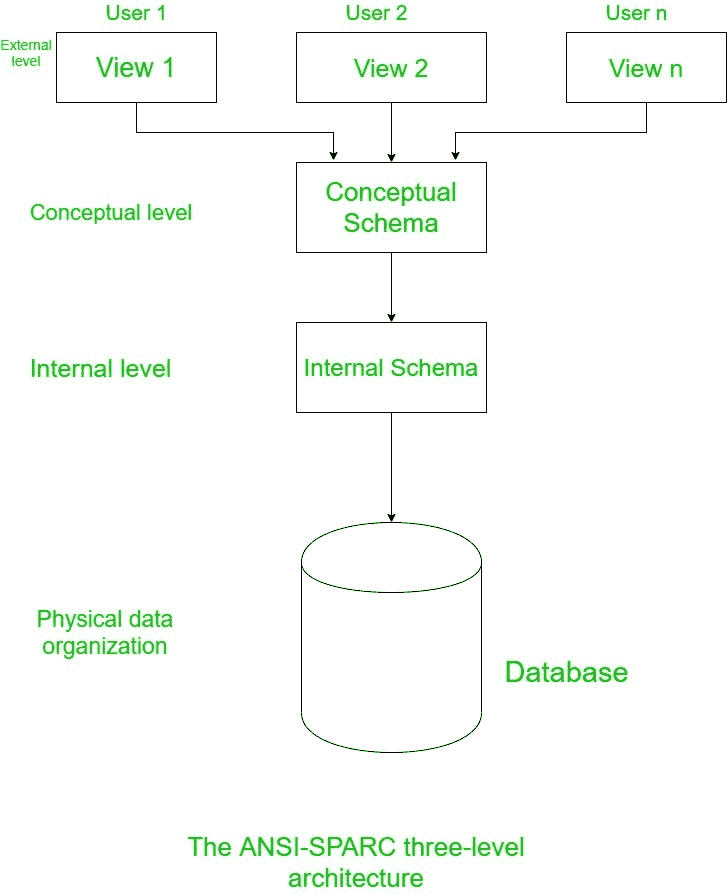

# 三级 ANSI-SPARC 架构

> 原文:[https://www . geesforgeks . org/the-三级-ansi-sparc-architecture/](https://www.geeksforgeeks.org/the-three-level-ansi-sparc-architecture/)

1971 年，DBTG(数据库任务组)意识到对具有视图和模式的两级方法的需求，随后，在 1975 年，ANSI-SPARC 意识到对三级方法的需求，其中三级抽象包括外部、概念和内部。

三层架构旨在将每个用户对数据库的视图与数据库的物理表示方式分开。

1.  **外部级别:**
    是用户如何查看数据库的视图。与该用户相关的数据库数据在此级别进行描述。外部层由数据库的几个不同的外部视图组成。在外部视图中，只包含用户需要的实体、属性和关系。不同的视图可能有不同的方式来表示相同的数据。例如，一个用户可以查看表单中的姓名(名字，姓氏)，而另一个用户可以查看为(姓氏，姓氏)。
2.  **概念层面:**
    它是数据库的社区视图，描述了数据库中存储了哪些数据，并表示了实体、它们的属性以及它们之间的关系。它表示关于数据的语义、安全性和完整性信息。三层体系结构中的中间层或第二层是概念层。该级别包含整个数据库的逻辑结构，它代表组织要求的数据库的完整视图，与任何存储考虑无关。
3.  **内部级别:**
    在内部级别，数据库在计算机上以物理方式表示。它强调数据库的物理实现，以实现存储空间利用率和最佳运行时性能，以及数据加密技术。它与操作系统接口，将数据放在存储文件上，建立存储空间，检索数据等。