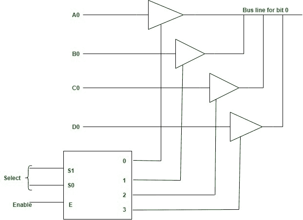

# 三态总线缓冲器

> 原文:[https://www.geeksforgeeks.org/three-state-bus-buffers/](https://www.geeksforgeeks.org/three-state-bus-buffers/)

通常，任何逻辑电路都有 2 种状态，即二进制形式(0 和 1)。缓冲器呈现三种状态。它有 3 个引脚，包括:
**输入**–接受 1 或 0(0–禁用和 1–启用)
**输出**–如果 3 态控制为 0，则输出跟随输入(根据输入 0 和 1)。

**定义:**
三态总线缓冲器是将多个数据源连接到单个总线的集成电路。开路驱动器可以选择为逻辑高、逻辑低或允许其他缓冲器驱动总线的高阻抗。

现在，让我们看一下 3 态总线缓冲器的更详细分析，以点为单位:

1.  和传统的门一样，1 和 0 是两种状态。
2.  第三种状态是高阻抗状态。
3.  第三种状态表现得像开路。
4.  如果输出没有连接，那么就没有逻辑意义。
5.  它可以执行任何类型的常规逻辑操作，例如与、或、与非等。

**正常缓冲与三态缓冲的区别:**
既包含正常输入，也包含控制输入。这里，输出状态由控制输入决定。

*   当控制输入为 1 时，输出使能，栅极将像传统缓冲器一样工作。
*   当控制输入为 0 时，输出被禁用，栅极将处于高阻抗状态。

**更多积分:**

1.  为了形成一条总线，4 个缓冲器的所有输出连接在一起。
2.  控制输入现在将决定 4 个正常输入中的哪一个将与总线通信。
3.  解码器用于确保一次只有一个控制输入有效。
4.  三态缓冲器的示意图如下所示。

**图–**带三态缓冲器的总线线路