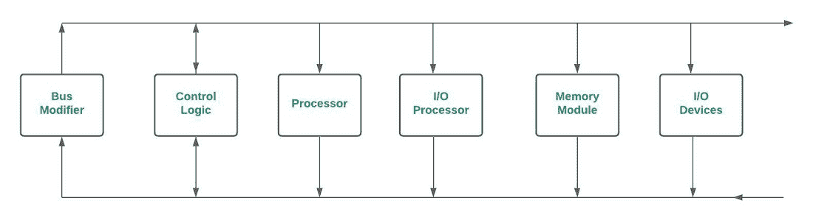
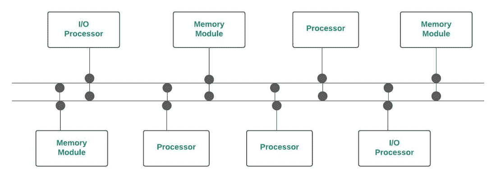

# 时间共享总线–多处理器系统中的互连结构

> 原文:[https://www . geesforgeks . org/分时总线-互连-多处理器系统中的结构/](https://www.geeksforgeeks.org/time-shared-bus-interconnection-structure-in-multiprocessor-system/)

**互连结构:**
处理器必须能够在多处理器系统中共享一组主内存模块& I/O 设备。这种共享能力可以通过互连结构来提供。常用的互连结构如下所示–

1.  分时/公共总线
2.  [横杆开关](https://www.geeksforgeeks.org/crossbar-switch/)
3.  [多端口存储器](https://www.geeksforgeeks.org/multiport-memory-multiprocessor-system/)
4.  多级交换网络(第二部分)
5.  [超立方体系统](https://www.geeksforgeeks.org/hypercube-interconnection/#:~:text=Related%20Articles&text=Hypercube%20(or%20Binary%20n%2Dcube,a%20node%20of%20the%20cube.)

在本文中，我们将详细介绍时间共享/公共总线。

**1。分时/公共总线(多处理器系统中的**互连结构):
在多处理器系统中，分时总线互连提供了连接所有功能单元(如处理器、输入/输出处理器、存储单元等)的公共通信路径。下图显示了具有公共通信路径(单总线)的多个处理器。

单总线多处理器组织

为了与任何功能单元通信，处理器需要总线来传输数据。为此，处理器首先需要通过检查总线的状态来查看总线是否可用。如果总线被其他功能单元使用，则状态为忙碌，否则为空闲。

只有当总线空闲时，处理器才能使用总线。发送方处理器将目的地的地址放在总线上&目的地单元识别它。为了与任何功能单元通信，会发出一个命令，告诉该单元要做什么工作。当时的其他处理器要么忙于内部操作，要么空闲下来，等待总线。
如果有冲突，我们可以使用总线控制器来解决。(总线控制器可以设置不同功能单元的优先级)
这种单总线多处理器组织最容易重新配置&简单。这种互连结构只包含无源元件。发送方&接收方单元的总线接口控制这里的传输操作。
为了在没有冲突的情况下决定对公共总线的访问，可以使用静态&固定优先级、先进先出(FIFO)队列&菊花链等方法。

**优势–**

*   便宜，因为不需要额外的硬件，如开关。
*   简单且易于配置，因为功能单元直接连接到总线。

**缺点–**

*   这种配置的主要问题是，如果任何总线接口电路出现故障，整个系统都将失败。
*   **吞吐量下降** —
    一次只有一个处理器可以与任何其他功能单元通信。
*   **增加了** [**仲裁逻辑**](https://www.geeksforgeeks.org/bus-arbitration-in-computer-organization/#:~:text=Related%20Articles&text=Bus%20Arbitration%20refers%20to%20the,known%20as%20a%20Bus%20master.) —
    随着处理器&内存单元数量的增加，总线争用问题也随之增加。

为了解决上述缺点，我们可以使用两条单向总线，如下所示:

具有单向总线的多处理器系统

在一次传输操作中需要两条总线。这里，系统复杂性增加，可靠性降低，解决方案是使用多条双向总线。

**多条双向总线:**
多条双向总线意味着系统中有多条双向总线。它允许尽可能多的公交车同时换乘。但是这里也增加了系统的复杂性。

多双向多处理器系统

影响客车性能的因素除了组织外，还有很多。他们是–

*   总线上活动设备的数量。
*   数据宽度
*   错误检测方法
*   数据传输的同步等。

**多条双向公交***–*的优势

*   **硬件成本最低，因为不需要额外的设备，如交换机。**
*   **修改硬件系统配置很容易。**
*   **与其他互连方案相比，不太复杂，因为只有两条总线&所有组件都通过该总线连接。**

****多条双向总线的缺点–****

*   **系统扩展会降低性能，因为随着功能单元数量的增加，需要更多的通信，但一次只能通过一条总线进行一次传输。**
*   **整体系统容量限制了传输速率&如果总线出现故障，整个系统都会出现故障。**
*   **仅适用于小型系统。**

****2。纵横制交换机:**
如果公共总线系统中的总线数量增加，则每个内存模块都有单独的可用路径。交叉开关(对于多处理器)为每个模块提供单独的路径。**

****3。多端口存储器:**
在多端口存储器系统中，控制、交换&优先级仲裁逻辑分布在交叉开关矩阵中，交叉开关矩阵分布在存储器模块的接口处。**

****4。超立方体互联:**
这是一个二进制 n 立方体架构。这里我们可以连接 2n 个处理器，这里的每个处理器形成立方体的一个节点。一个节点可以是内存模块，也可以是输入输出接口，不一定是处理器。节点处的处理器具有直接通向 n 个其他节点(总共 2n 个节点)的通信路径。总共有 2n 个不同的 n 位二进制地址。**

****结论:**
互连结构可以决定多处理器环境下系统的整体性能。虽然使用普通总线系统要容易得多&简单，但是只有 1 条路径的可用性是它的主要缺点&如果总线出现故障，整个系统都会出现故障。为了克服这一点&提高整体性能，纵横制、多端口、超立方体&于是多级交换网络就进化了。**