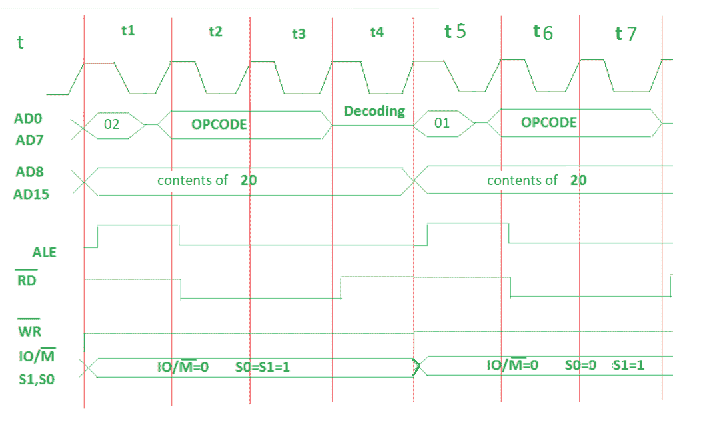

# MVI 指令时序图

> 原文:[https://www . geesforgeks . org/time-diagram-mvi-instruction/](https://www.geeksforgeeks.org/timing-diagram-mvi-instruction/)

**问题–**画出以下代码的时序图，

```
MVI B, 45 
```

**命令解释–**它将立即的 8 位数据存储到寄存器或存储器位置。

示例:MVI B，45
操作码:MVI
操作数:B 是目的寄存器，45 是需要传输到寄存器的源数据。
‘45’数据将存储在 B 寄存器中。

**算法–**

*   决定什么是操作码，什么是数据。这里，操作码是‘MVI B’，数据是 45。
*   假设操作码和数据的内存地址。例如:

    ```
    MVI B, 45
    2000: Opcode
    2001: 45
    ```

*   操作码提取在所有指令中都是相同的。
*   只有操作码的读指令需要在连续的 T 状态中添加。
*   对于操作码提取，输入输出/输出(低电平有效)= 0，S1 = 1，S0 = 1。此外，从内存中获取操作码需要 4 T 状态。
*   For the opcode read the IO/M (low active) = 0, S1 = 1 and S0 = 0\. Also, only 3 T states will be required to read data from memory.

    

    **在操作码提取(t1-t4 测试状态)–**

    *   00–操作码存储地址的低位。
    *   20–操作码存储地址的高位。
    *   ALE–为多路复用地址和数据总线提供信号。只有在 t1 中，它用作地址总线来获取地址的低位，否则它将用作数据总线。
        RD(低电平有效)–t1&T4 中的信号为 1，微处理器未读取任何数据。t2 & t3 信号为 0，微处理器读取数据。
        WR(低电平有效)–信号始终为 1，微处理器未写入任何数据。
        输入输出/输出(低电平有效)–信号始终为 0，操作正在内存中执行。
        S0 和 S1-信号在 t1 至 t4 状态下为 1，以便从存储器中获取操作码。

    **操作码读取(t5-t7 T 状态)–**

    *   01–存储数据的地址低位。
    *   20–存储数据的高位地址。
    *   ALE–为多路复用地址和数据总线提供信号。仅在 t5，它用作地址总线以获取地址的低位，否则它将用作数据总线。
        RD(低电平有效)–信号在 t5 为 1，因为微处理器未读取任何数据。当微处理器读取数据时，t6 & t7 中的信号为 0。
        WR(低电平有效)–信号始终为 1，微处理器未写入任何数据。
        输入输出/输出(低电平有效)–信号始终为 0，操作正在内存中执行。
        S0–信号始终为 0，操作正在存储器上执行，以读取数据 45。
        S1–信号始终为 1，正在对存储器执行操作以读取数据 45。