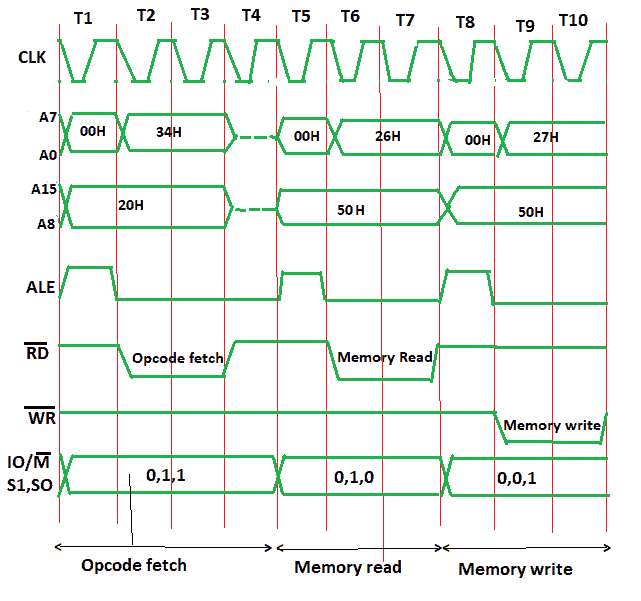

# INR M 时序图

> 原文:[https://www.geeksforgeeks.org/timing-diagram-of-inr-m/](https://www.geeksforgeeks.org/timing-diagram-of-inr-m/)

**问题–**画出 8085 中给定指令的时序图，

```
INR M 
```

指定寄存器/存储单元(M)中的内容加 1，结果存储在相同的位置。如果操作数是内存位置，则由 HL 对的内容指定。
**例:**

```
INR M
Opcode: INR
Operand: M 
```

M 是内存位置(比如 5000H)，假设 M(或者 5000H)处的数据是 26H，需要加 1。十六进制代码- 34H

**算法–**
指令 INR M 为 1 字节；因此，完整的指令将被存储在单个存储器地址中。
例如:

```
2000: INR M 
```

操作码提取将与前 4 T 状态下的其他指令相同。
在连续的 T 状态下，只需要增加内存读取和内存写入。
对于操作码获取，输入输出/输出(低电平有效)= 0，S1 = 1，S0 = 1。
对于内存，读取 IO/M(低电平有效)= 0，S1 = 1，S0 = 0。此外，只需要 3 个测试状态。
对于存储器写操作，需要输入输出/输出(低电平有效)= 0、S1 = 0 和 S0 = 1 和 3 T 状态。

INR M 指令的时序图如下所示:



**在操作码提取(t1-t4 测试状态)–**

*   **00:** 存储操作码的地址低位，即 00
*   **20:** 操作码存储地址的高位，即 20。
*   **ALE:** 为多路复用的地址和数据总线提供信号。只有在 t1 中，它用作地址总线来获取地址的低位，否则它将用作数据总线。
*   **RD(低电平有效):**信号在 t1 & t4 为 1，因为微处理器没有读取数据。t2 & t3 中的信号为 0，因为这里的数据由微处理器读取。
*   **WR(低电平有效):**信号始终为 1，微处理器未写入任何数据。
*   **IO/M(低电平有效):**信号始终为 0，因为操作正在内存上执行。
*   **S0 和 S1:** 取操作码时都是 1。

**内存读取(t5-t7 T 状态)–**

*   **00:** 存储操作码的地址低位，即 00
*   **50:** 操作码存储地址的高位，即 50。
*   **ALE:** 为多路复用的地址和数据总线提供信号。仅在 t5，它用作地址总线以获取地址的低位，否则它将用作数据总线。
*   **RD(低电平有效):**信号在 t5 为 1，微处理器未读取任何数据。t6 & t7 中信号为 0，数据由微处理器读取。
*   **WR(低电平有效):**信号始终为 1，微处理器未写入任何数据。
*   **IO/M(低电平有效):**信号始终为 0，操作正在内存上执行。
*   S0 和 S1–读取操作的 S1=1 和 S0=0。

**内存写入(t8-t10 测试状态)–**

*   **00:** 存储操作码的地址低位，即 00
*   **50:** 操作码存储地址的高位，即 50。
*   **ALE:** 为多路复用的地址和数据总线提供信号。仅在 t8 中，它用作地址总线以获取地址的低位，否则它将用作数据总线。
*   **RD(低电平有效):**信号始终为 1，微处理器未读取任何数据。
*   **WR(低电平有效):**t8 中信号为 1，微处理器未写入数据。t9 & t10 信号为 0，数据由微处理器写入。
*   **IO/M(低电平有效):**信号始终为 0，操作正在内存上执行。
*   S0 和 S1–写操作的 S1=0 和 S0=1。