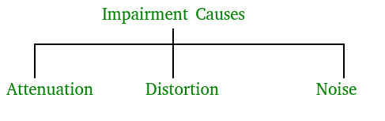
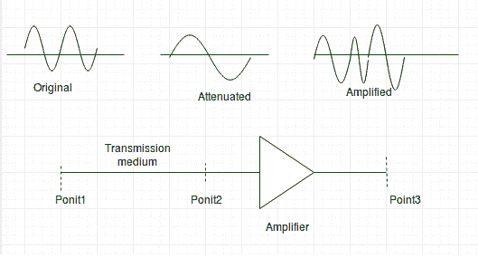
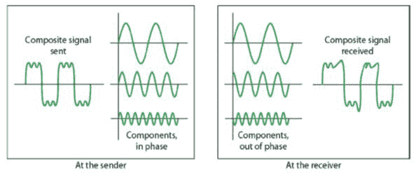
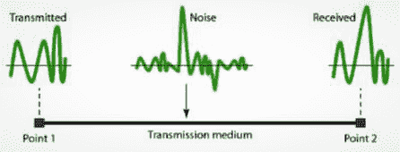

# 数据通信中的传输损伤

> 原文:[https://www . geesforgeks . org/transmission-数据通信中的损伤/](https://www.geeksforgeeks.org/transmission-impairment-in-data-communication/)

在通信系统中，模拟信号通过传输介质传输，这往往会降低模拟信号的质量，这意味着介质开头的信号与介质结尾的信号不一样。这种缺陷会导致信号受损。以下是减值的原因。

**损伤原因–**



*   **Attenuation –** It means loss of energy. The strength of signal decreases with increasing distance which causes loss of energy in overcoming resistance of medium. This is also known as attenuated signal. Amplifiers are used to amplify the attenuated signal which gives the original signal back and compensate for this loss.



*   Image Source – [aviationchief](http://www.aviationchief.com/uploads/9/2/0/9/92098238/19_1.jpg) 

    衰减以**分贝(dB)** 为单位测量。它测量两个信号或一个信号在两个不同点的相对强度。

> **衰减(分贝)= 10log10(P2/P1)**

P1 是发送端的权力，P2 是接收端的权力。

有些地方分贝也是用电压而不是功率来定义的。在这种情况下，因为功率与电压的平方成正比，所以公式为

> **衰减(分贝)= 20log10(V2/V1)**

V1 是发送端的电压，V2 是接收端的电压。

*   **失真–**表示信号形式或形状的变化。这通常见于由不同频率组成的复合信号。每个频率分量在介质中的传播速度各不相同。这就是为什么它会延迟到达最终目的地每个组件到达的时间不同，从而导致失真。因此，它们在接收端与在发送端具有不同的相位。



*   **Noise –** The random or unwanted signal that mixes up with the original signal is called noise. There are several types of noise such as induced noise, crosstalk noise, thermal noise and impulse noise which may corrupt the signal. 

    **感应**噪声来源于电机、电器等。这些设备充当发送天线，传输介质充当接收天线。**热**噪声是电子在电线中的运动，产生额外的信号。**串扰**噪声是指一根线影响另一根线。**脉冲**噪声是来自闪电或电力线
    的高能量信号



*   为了找到理论比特率限制，我们需要知道比率。信噪比定义为

```
  SNR = AVG SIGNAL POWER / AVG NOISE POWER  

```

**参考资料–**
[数据通信与网络第四版作者:Forouzan](https://www.flipkart.com/data-communications-networking-4th/p/itmef2pbg6kmz67f)
[数据通信–slide share](https://www.slideshare.net/SyedRizwanAli/data-communication-unit-1)