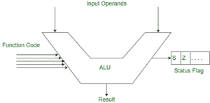
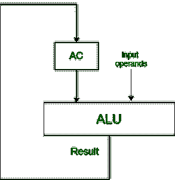
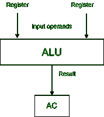
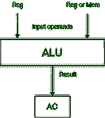
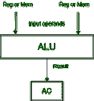
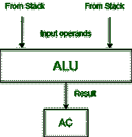

# 基于算术逻辑单元输入的体系结构类型

> 原文:[https://www . geesforgeks . org/基于输入到 alu 的架构类型/](https://www.geeksforgeeks.org/types-of-architecture-based-on-input-to-alu/)

《计算机基础设计》说，算术逻辑单元采用两种类型的输入(输入操作数、功能代码)来执行一个程序，并产生两种类型的输出(结果、各种状态信号。)

让我们更深入地了解基于算术逻辑单元如何获得输入的体系结构类型，这意味着算术逻辑单元从哪里获得输入操作数。我们假设 ALU 需要两个输入操作数来执行运算。

**建筑类型:**
**1。基于累加器的体系结构:**在这种体系结构中，算术逻辑单元的一个输入操作数来自累加器，另一个输入操作数来自寄存器、存储器等。获得输入操作数后，算术逻辑单元对操作数进行运算，结果将存储在累加器中。

**2。基于寄存器的体系结构:**
在这种体系结构中，算术逻辑单元从寄存器中获取两个输入操作数，在获取输入操作数后，算术逻辑单元对操作数执行运算，结果将存储在累加器中。

假设最初你的输入操作数存储在内存中，然后你首先从内存转移到一个寄存器中执行。

**3。寄存器-存储器体系结构:**
在这种体系结构中，算术逻辑单元从寄存器中获取一个输入操作数，而另一个输入操作数不受限制，只能从寄存器中获取(即，非强制输入只能从寄存器或存储器中获取可选输入)。获得输入操作数后，算术逻辑单元对操作数进行运算，结果将存储在累加器中。

**4。复杂系统架构:**
在这种架构中，输入操作数进入算术逻辑单元没有限制。两个输入操作数都可以从存储器或寄存器等任何地方自由获取。在获得输入操作数后，算术逻辑单元对操作数进行运算，结果将存储在累加器中。

**5。基于堆栈的体系结构:**
在这种类型的体系结构中，算术逻辑单元从堆栈中获取两个输入操作数，方法是在获取输入操作数后弹出堆栈的两个最上面的元素。算术逻辑单元对操作数执行操作，结果将存储在累加器中。

我们还根据输入操作数的最大大小划分体系结构。例如，

基于处理器字长的 32 位架构、64 位架构