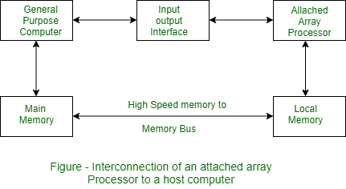
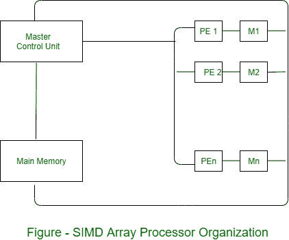

# 阵列处理器的类型

> 原文:[https://www.geeksforgeeks.org/types-of-array-processor/](https://www.geeksforgeeks.org/types-of-array-processor/)

阵列处理器对大量数据进行计算。这是两种类型的阵列处理器:附加阵列处理器和 SIMD 阵列处理器。这些解释如下。

**1。附加阵列处理器:**
为了提高主机在数值计算任务中的性能，附加了辅助处理器。

连接的阵列处理器有两个接口:

1.  公共处理器的输入输出接口。
2.  与本地存储器接口。

这里本地存储器与主存储器互连。主机是通用计算机。附加处理器是由主机驱动的后端机器。

阵列处理器通过输入/输出控制器连接到计算机&计算机将其视为外部接口。

**2。SIMD 阵列处理器:**
这是一台具有多个并行处理单元的计算机。两种类型的阵列处理器都处理向量，但它们的内部组织不同。

SIMD 是一台有多个并行处理单元的计算机。

处理单元被同步以在公共控制单元的控制下执行相同的操作。从而提供单个指令流、多个数据流(SIMD)的组织。如图所示，SIMD 包含一组相同的处理元件(PES)，每个元件都有一个本地存储器 m

**每个 PE 包括–**

*   土豆*   浮点运算单元*   Working registers

    主控单元控制 PEs 中的操作。主控单元的功能是对指令进行解码，并确定如何执行指令。如果指令是标量或程序控制指令，则它直接在主控制单元内执行。

    主存储器用于存储程序，而每个 PE 使用存储在其本地存储器中的操作数。