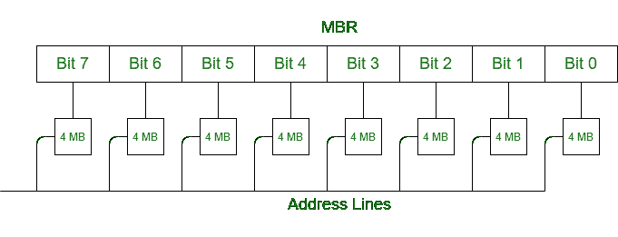
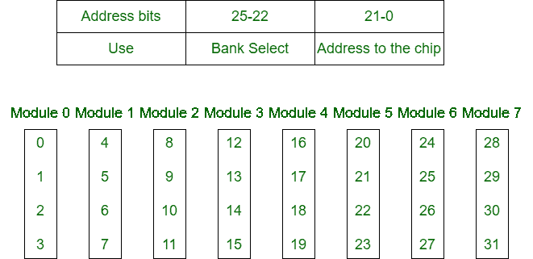
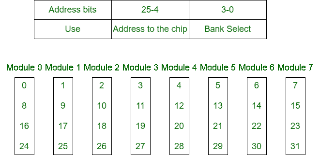

# 内存交错的类型

> 原文:[https://www.geeksforgeeks.org/types-of-memory-interleaving/](https://www.geeksforgeeks.org/types-of-memory-interleaving/)

[内存交错](https://www.geeksforgeeks.org/memory-interleaving/)是一种抽象技术，它将内存划分为多个模块，使得地址空间中的连续字被放置在不同的模块中。

假设 64 MB 内存由 4 MB 芯片组成，如下图所示:

我们将内存组织成 4 MB 的存储体，每个存储体有 8 个 4 MB 的芯片。因此，存储器有 16 个存储体，每个存储体 4 MB。

64 MB 内存= 2^26，因此 26 位用于寻址。
16 = 2^4，所以 4 位地址选择存储体，4 MB = 2^22，所以每个芯片 22 位地址。

一般来说，N = 1+M 的 N 位地址分为两部分:

1.  l 位存储体选择，用于激活 2^L 存储体之一，以及
2.  发送到每个存储体的 m 位地址。

当其中一个存储体激活时，其他存储体(2L–1)不激活。所有存储体都接收 M 位地址，但非活动存储体不响应它。

**记忆交错的分类:**
记忆交错分为两种类型:

**1。高阶交错–**
在高阶交错中，地址的最高有效位选择存储芯片。最低有效位作为地址发送到每个芯片。一个问题是连续的地址往往在同一个芯片上。数据传输的最大速率受到内存周期时间的限制。

它也被称为记忆银行。

**2。低阶交错–**
在低阶交错中，最低有效位选择存储体(模块)。在这种情况下，连续的内存地址位于不同的内存模块中。这允许以比周期时间所允许的快得多的速率来访问存储器。

