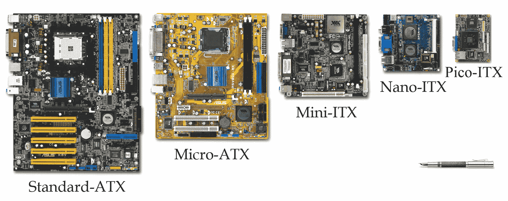
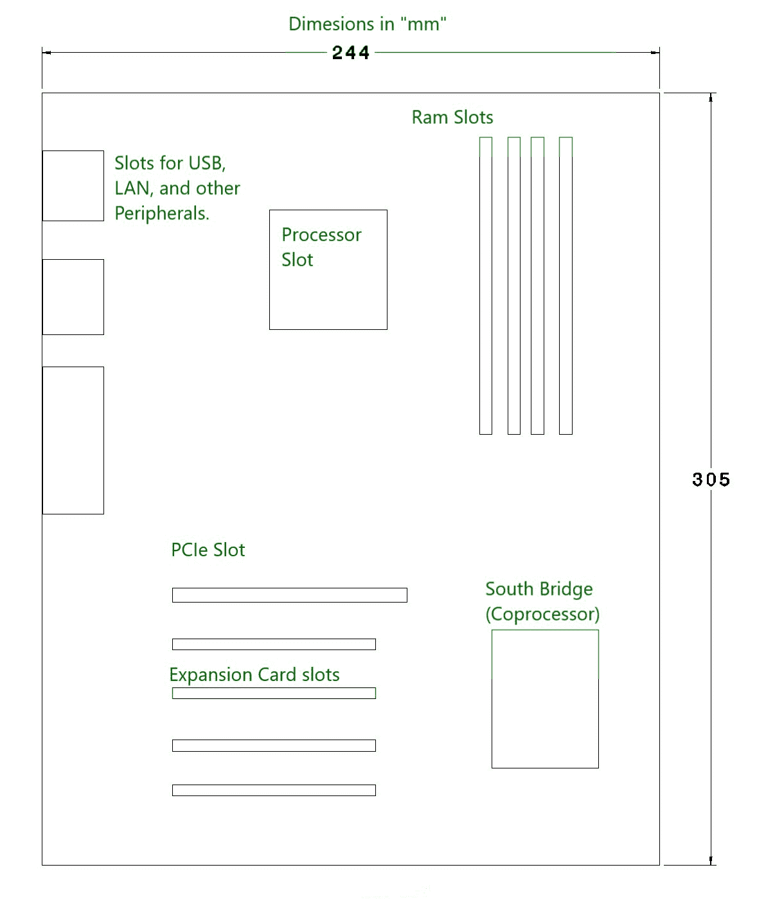
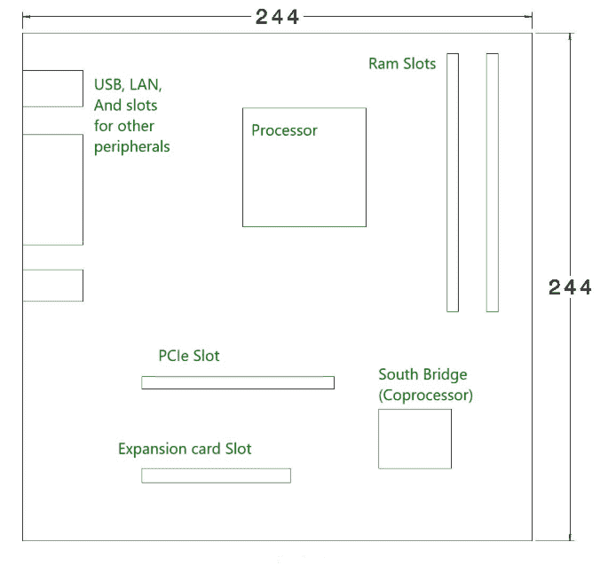
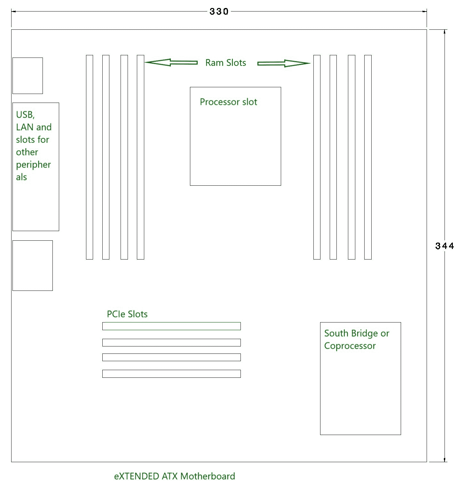

# 主板类型

> 原文:[https://www.geeksforgeeks.org/types-of-motherboards/](https://www.geeksforgeeks.org/types-of-motherboards/)

[主板](https://www.geeksforgeeks.org/what-is-a-motherboard/)的尺寸并不多，但在本文中，我们将讨论可用的选项以及何时使用合适的尺寸。



**主板**采用名为高级技术扩展(ATX)的外形规格进行描述，该外形规格由*英特尔*公司发明，多年来一直是行业标准。ATX 不仅描述了主板布局，还为电源和 PC 机柜以及不同的连接器制定了规格，以实现兼容性。

现在，让我们来讨论一下主流台式电脑细分市场中可用的不同尺寸。

主要有三种尺寸:

```
1. Standard ATX
2. Micro ATX
3. eXtendend ATX 
```

这些解释如下。

1.  **Standard ATX –**
    This motherboard comes in 305*244mm (length*breadth) dimensions, these dimensions can vary with different manufacturer. This motherboard offers more expansion slots, up to four slots for RAM, Two or sometimes more than two PCIe slots for dual graphics cards and more USB and other ports for connectivity, also its size gives space in between components for airflow to keep heat in control. This size of motherboard is used by those who want more expansion slots and different connecting ports and deal with heavy workloads. This motherboard will only fit in cases which support full ATX or Extended ATX motherboards.

    

2.  **Micro ATX –**
    This motherboards come in 244*244 mm (length*breadth) dimensions (these dimensions can vary with different manufacturer.). This Motherboard has less ports and slots as compared to Standard ATX board. This type of motherboard is more suitable for those who don’t want to much connectivity and later upgrades like adding more ram and additional GPU or Graphics card and adding PCI cards. This board can fit any case which has enough room 244*244 mm of space and can also be fit in bigger cases which accept Standard ATX and eXTENDED ATX motherboards.

    

3.  **eXtendend ATX –**
    This motherboard is 344*330 mm dimensions (these dimensions can vary with different manufacturer). This motherboard is designed for both dual CPU and single configuration and has up to 8 ram slots and has more PCIe and PCI slots for adding PCI cards for different purposes. It is used for workstations and servers. Some EATX motherboards are also designed for desktop computing, and there is ample space for cooling and attaching peripherals.

    

    现在一天的技术越来越先进，你可以在微 ATX 板的标准 ATX 板上找到所有这些额外的插槽和电源。