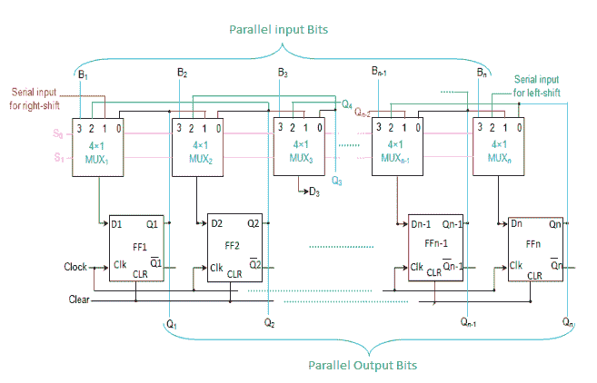

# 数字逻辑中的通用移位寄存器

> 原文:[https://www . geesforgeks . org/universal-shift-register-in-digital-logic/](https://www.geeksforgeeks.org/universal-shift-register-in-digital-logic/)

通用移位寄存器是同时具有右移位和左移位以及并行加载能力的寄存器。通用移位寄存器在计算机中用作存储元件。单向移位寄存器只能向一个方向移位。双向移位寄存器能够双向移位。通用移位寄存器是**双向**移位寄存器和**单向**移位寄存器的组合设计，具有并行负载提供。

**n 位通用移位寄存器–**
n 位通用移位寄存器由 n 个触发器和 n 个 4×1 多路复用器组成。所有 n 个多路复用器共享相同的选择线(S1 和 S0)来选择移位寄存器的工作模式。选择输入为触发器选择合适的输入。

**基本连接–**

1.  第一个输入(多路复用器的第零个引脚)连接到相应触发器的输出引脚。
2.  第二个输入(多路复用器的第一个引脚)连接到前一个触发器的输出，这有助于右移。
3.  第三个输入(多路复用器的第二个引脚)连接到下一个触发器的输出，这有助于左移。
4.  第四个输入(多路复用器的第三个引脚)连接到输入数据的各个位，便于并行加载。

通用移位寄存器的工作取决于给选择线的输入。

对选择线的各种输入执行的寄存器操作如下:

| S1 | s0 | 寄存器操作 |
| --- | --- | --- |
| Zero | Zero | 没有变化 |
| Zero | one | 右移 |
| one | Zero | 左移位 |
| one | one | 平行负载 |

**参考:**
数字电子-阿图尔·p·戈泽，迪帕利·a·戈泽夫人