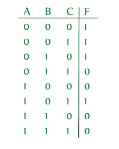
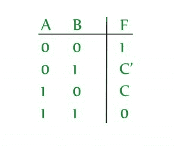
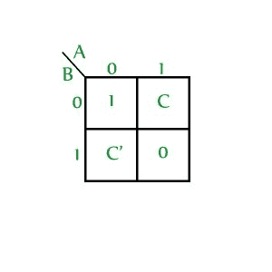
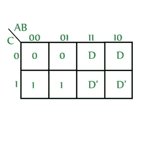
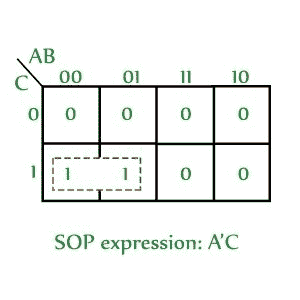
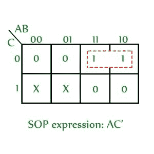

# 数字逻辑中的可变入口图(VEM)

> 原文:[https://www . geesforgeks . org/variable-entry-map-vem-in-digital-logic/](https://www.geeksforgeeks.org/variable-entrant-map-vem-in-digital-logic/)

先决条件–[卡诺图(K-map)](https://www.geeksforgeeks.org/k-mapkarnaugh-map/)
K-map 是求解布尔方程的最佳手动技术，但当变量数量超过 5 或 6 时，它变得难以管理。因此，一种称为可变入口图(VEM)的技术被用来增加 k 图的有效大小。它允许较小的映射处理大量变量。这是通过根据输入编写输出来完成的。

**示例–**如果输出用第三个变量表示，则三变量函数可以定义为两变量函数。

考虑一个函数 **F(A，B，C) = (0，1，2，5)**



如果我们用‘C’来定义 F，那么这个函数可以写成:



这个的 VEM 是:



**使用 VEM 的优势–**

*   使用“n”个变量的 K 图，VEM 可以用来绘制多于“n”个变量。

*   它通常用于解决涉及多路复用器的问题。

**VEM 的最小化程序–**现在，让我们看看如果给定一个 VEM，如何找到 SOP 表达式。

1.  将映射中的所有变量(原始形式和补充形式被视为两个不同的变量)写成 0，保留 0，minterms，不要在意，得到 SOP 表达式。

2.  (a)选择一个变量，并使该变量的所有出现次数都为 1，将 minterms (1)写为不关心，将 0 留为不关心。现在，获取 SOP 表达式。
    (b)将获得的标准操作程序表达式与相关变量相乘。

3.  对 k 图中的所有变量重复步骤 2。

4.  SOP of VEM is obtained by ORing all the obtained SOP expressions. 

    让我们在一个 VEM 样本上应用上述过程(X 用于表示不关心):



**第一步:**将所有变量写成 0 (D 和 D’被认为是两个不同的变量)，留下 minterms，0’不要管它是什么，得到 SOP 表达式。



```
 SOP obtained: A'C
```

**第二步:**
(a)将所有出现的 D 替换为 1，所有出现的 D’替换为 0，所有出现的 1 替换为不在乎。离开 0，不要在意现状。



将获得的标准操作程序乘以相关变量。

```
SOP obtained: AC'D
```

**步骤 3:** 对 D’重复步骤 2

(a)将所有出现的 D’替换为 1，将所有出现的 D 替换为 0，将所有出现的 1 替换为不在乎。离开 0，不要在意现状。


将获得的标准操作程序乘以相关变量。

```
SOP obtained: CD' 
```

**第四步:**VEM 的标准操作程序通过**或**得到所有的标准操作程序表达式。因此，给定 VEM 的标准操作程序表达式为:

```
A'C + AC'D + CD' 
```