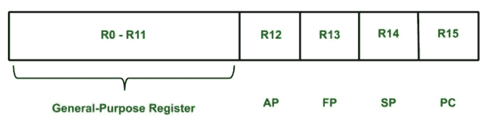

# VAX 架构

> 原文:[https://www.geeksforgeeks.org/vax-architecture/](https://www.geeksforgeeks.org/vax-architecture/)

**VAX 架构**旨在通过改进早期设计机器的硬件来增加兼容性。由于 VAX 体系结构是 CISC(复杂指令集计算机)的一个例子，因此系统中使用了大量复杂的指令集。

1.  **Memory:**
    VAX architecture consists of 8- bit bytes memory. Two consecutive bytes form a word, four bytes form a longword, eight bytes form a quadword, sixteen bytes form an octaword. All VAX programs operates on **Virtual Address Space** (2<sup>32</sup> bytes).
    The
    Virtual Address Space is divided into two spaces:
    *   **系统空间**
    *   **过程空间**
2.  **寄存器:**
    VAX 架构从 R0 到 R15 有 16 个通用寄存器。其中一些寄存器有特殊的名称和用途。



```
AP - *Argument Pointer*
FP - *Frame Pointer*
SP - *Stack Pointer*
PC - *Program Counter* 
```

*   **Data Formats:**
    *   整数以二进制数的形式存储在字节、字、长字、四字或八字中。
    *   字符用 8 位 ASCII 码表示。
    *   浮点用四种不同的浮点格式表示，长度从 4 字节到 16 字节不等。*   **Instruction Formats:**
    VAX machine architecture use a variable-length instruction format. Each instruction consists of an operand code (1 or 2 bytes) followed by up to six operand specifier, depending on the type of instruction.*   **Addressing Modes:**
    VAX architecture use a large number of addressing modes. There are number of modes available such as register mode, register deferred mode, autoincrement and autodecrement mode. There are also base relative addressing modes, with displacement fields of different lengths. Program counter relative mode is also used to deal with PC register.*   **Instruction Set:**
    In VAX systems instruction mnemonics are formed by combining following elements:
    *   **前缀:**前缀指定操作类型。
    *   **后缀:**后缀指定操作数的数据类型。
    *   **修饰符:**修饰符指定涉及的操作数的数量。*   **输入输出:**
    I/O 设备控制器用于在 VAX 架构上实现 I/O。每个控制器都有一组控制/状态。设备控制器寄存器映射到的那部分空间称为输入/输出空间。