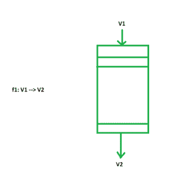
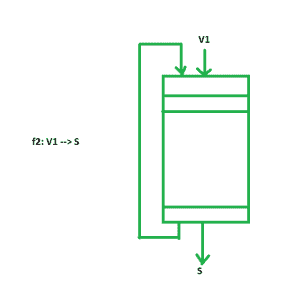
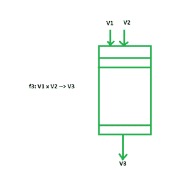
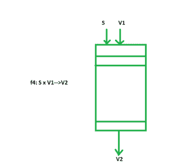

# 矢量指令类型

> 原文:[https://www.geeksforgeeks.org/vector-instruction-types/](https://www.geeksforgeeks.org/vector-instruction-types/)

一个**向量操作数**包含一组有序的 n 个元素，其中 n 被称为向量的**长度。向量中的所有元素都是相同类型的标量，可以是浮点数、整数、逻辑值或字符。**

矢量指令的四种基本类型是:

```
f1 : V --> V
f2 : V --> S
f3 : V x V --> V
f4 : V x S --> V 
```

其中 V 和 S 分别表示向量操作数和标量操作数。

指令 f1 和 f2 是一元运算，f3 和 f4 是二元运算。
**VCOM(矢量补码)**，它对矢量的每个补码进行补码，是 f1 运算。f1 操作的管线实施如图所示:



**VMAX(向量最大值)**，从向量中的所有补数中找出最大标量，是一个 f2 运算。f2 操作的管线实施如图所示:



**VMPL(向量乘法)**，将两个向量操作数各自的标量分量相乘并产生另一个乘积向量，是一个 f3 运算。f3 操作的管线实施如图所示:



将一个常数值乘以向量的每个分量的 **SVP(标量向量乘积)**是 f4 运算。f4 操作的管线实现如图所示:



输入作为管道中的标量分量给出。除了这些基本类型的指令之外，还可以使用一些特殊的指令来促进向量数据的操作。