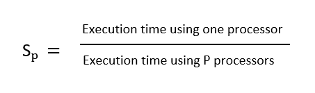
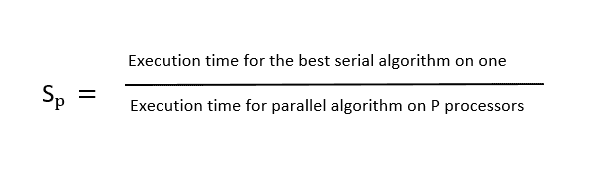

# 矢量性能建模–矢量处理器架构

> 原文:[https://www . geesforgeks . org/vector-performance-modeling-vector-processor-architecture/](https://www.geeksforgeeks.org/vector-performance-modelling-vector-processor-architecture/)

**矢量性能建模:**
有两个参数可以描述矢量处理器的性能–

*   渐近性能或理论峰值性能(r 到基数∞)。
*   半演出长度(n₁/₂).

理论峰值性能是处理器可以实现的最大可能计算速率，用 FLOPS(每秒浮点指令数)表示。该参数可用于测量单个矢量处理器和多个矢量处理器的性能。例如，单个 Cray Y-MP 处理器的渐近性能为 167 MFLOPS，而 Cray Y-MP 的 8 处理器系统的渐近性能为 2.6 GFLOPS。

半性能长度，顾名思义，是指性能为峰值性能一半的向量长度。矢量处理器的性能取决于矢量启动时间和流水线深度。如果这些启动时间和管道深度持续增加，就很难达到峰值性能。因此，预计它将至少达到峰值性能或 n₁/₂值的一半。

除了这些参数之外，任何多处理器系统的基本性能指标都是相同的，即加速因子。加速因子是一个处理器的执行时间与“P”处理器的执行时间之比。也可以说是‘P’个处理器同时执行的速度与单个处理器的速度之比。

这个性能参数的特点是它考虑了执行时间，因此并行系统的所有开销都已经考虑在内了。需要考虑的一个非常重要的点是，同一程序不能针对并行处理器和单个处理器进行测试。这是因为在单个处理器和并行处理器上执行任务的算法会有所不同。

此外，当比较在单处理器和并行处理器中执行问题所需的时间时，顺序处理器上要考虑的时间必须是所需的最佳算法时间。因此，我们可以说加速比可以表示为–

