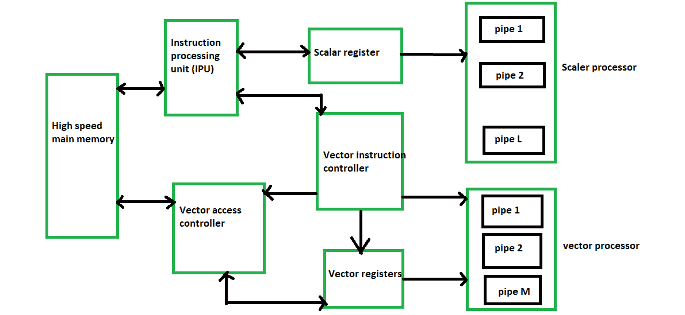

# 矢量处理器分类

> 原文:[https://www . geesforgeks . org/vector-processor-classification/](https://www.geeksforgeeks.org/vector-processor-classification/)

根据操作数在向量处理器中的检索位置，流水线向量计算机分为两种架构配置:

1.  **内存到内存架构–**
    在内存到内存架构中，源操作数、中间结果和最终结果直接从主内存中检索(读取)。对于内存到内存的向量指令，必须指定基址、偏移量、增量和向量长度的信息，以便能够在主内存和流水线之间传输数据流。像 *TI-ASC、疾控中心 STAR-100 和赛博-205* 这样的处理器在内存中有矢量指令到内存格式。内存到内存架构的要点是:
    *   大小没有限制
    *   在这种体系结构中，速度相对较慢
2.  **寄存器到寄存器架构–**
    在寄存器到寄存器架构中，操作数和结果通过使用大量向量寄存器或标量寄存器间接从主存储器中检索。像 *Cray-1 和富士通 VP-200* 这样的处理器使用寄存器中的向量指令来注册格式。注册到注册架构的要点是:
    *   寄存器到寄存器体系结构的大小有限。
    *   与内存到内存架构相比，速度非常高。
    *   这种架构的硬件成本很高。

现代多流水线矢量计算机的框图如下所示:

典型的流水线矢量处理器。