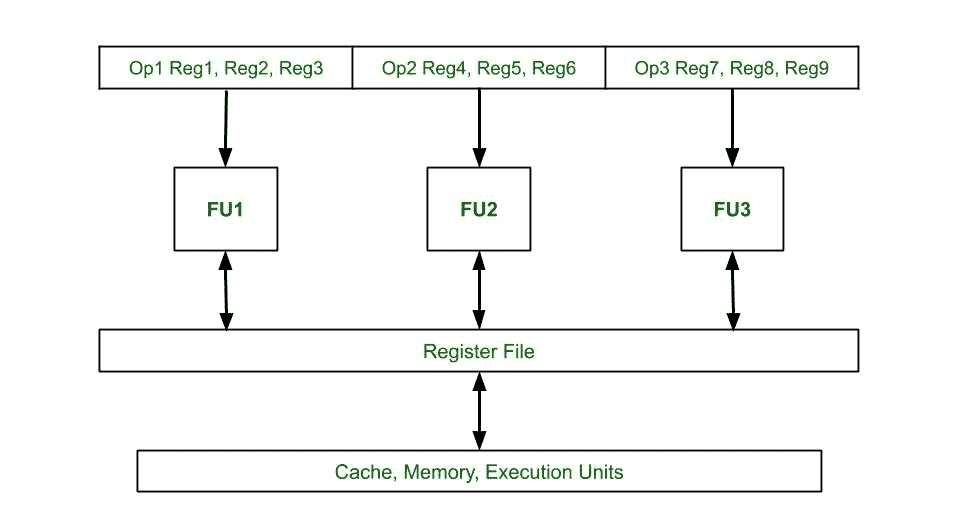
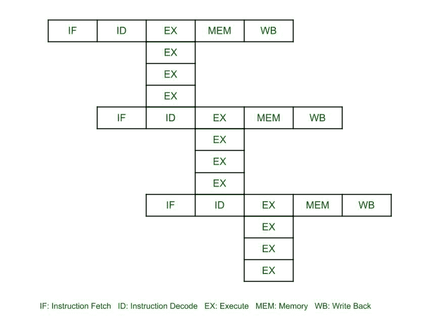

# 超长指令字(VLIW)架构

> 原文:[https://www . geesforgeks . org/超长指令字-vliw-architecture/](https://www.geeksforgeeks.org/very-long-instruction-word-vliw-architecture/)

超标量处理器的局限性是突出的，因为调度指令的难度变得复杂。指令流中的内在并行性、复杂性、成本和分支指令问题通过称为**超长指令字(VLIW)** 或 **VLIW 机器**的更高指令集架构来解决。

VLIW 使用[指令级并行](https://www.geeksforgeeks.org/instruction-level-parallelism/)，即它有程序来控制指令的并行执行。在其他体系结构中，处理器的性能通过使用以下方法中的任何一种来提高:流水线(将指令分成子部分)、超标量处理器(在处理器的不同部分独立执行指令)、无序执行(对程序执行不同的顺序)，但是这些方法中的每一种都大大增加了硬件的复杂性。VLIW 架构通过依赖编译器来处理它。程序决定指令的并行流并解决冲突。这增加了编译器的复杂性，但大大降低了硬件的复杂性。

**特征:**

*   该体系结构中的处理器具有多个功能单元，从具有超长指令字的指令高速缓存中获取指令。
*   多个独立的操作被组合在一条超长指令字指令中。它们在同一时钟周期内初始化。
*   每个操作都被分配一个独立的功能单元。
*   所有功能单元共享一个公共寄存器文件。
*   指令字的长度通常为 64-1024 位，具体取决于执行单元的数量和控制每个单元所需的代码长度。
*   指令调度和字的并行分派由编译器静态完成。
*   编译器在调度指令的并行执行之前检查依赖性。

超长指令字体系结构框图

超长指令字处理器的时空图，其中 4 条指令在单个指令字中并行执行

**优势:**

*   降低硬件复杂性。
*   由于降低了硬件复杂性，降低了功耗。
*   由于编译器负责数据依赖检查、解码和指令问题，所以它变得简单多了。
*   增加潜在的时钟频率。
*   编译器将功能单元定位到与指令袋相对应的位置。

**缺点:**

*   需要复杂的编译器，很难设计。
*   增加程序代码大小。
*   更大的内存带宽和寄存器文件带宽。
*   未计划的事件，例如高速缓存未命中，可能导致停顿，这将使整个处理器停顿。
*   在超长指令字中出现未填充操作码的情况下，会浪费内存空间和指令带宽。