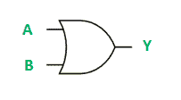

# 与门和或逻辑门的 VHDL 代码

> 原文:[https://www . geesforgeks . org/VHDL-用于与门或逻辑门的代码/](https://www.geeksforgeeks.org/vhdl-code-for-and-and-or-logic-gates/)

先决条件–[逻辑门介绍](https://www.geeksforgeeks.org/introduction-of-logic-gates/)
使用 VHDL (VHSIC 硬件描述语言)编程语言设计并实现**和**或**逻辑门。**

****1。与门的逻辑开发:**
与门可以如下实现–**

****

**与门的真值表是:**

<center>

| A | B | Y = A 和 B |
| --- | --- | --- |
| Zero | Zero | Zero |
| Zero | one | Zero |
| one | Zero | Zero |
| one | one | one |

</center>

****实现–**
下面是用 VHDL 语言实现上述逻辑。**

```
-- *VHDL Code for AND gate*

-- *Header file declaration*

**library** IEEE;
**use** IEEE.std_logic_1164.**all**;

-- *Entity declaration*

**entity** andGate **is**

    **port**(A : in std_logic;      -- *AND gate input*
         B : in std_logic;      -- *AND gate input*
         Y : out std_logic);    -- *AND gate output*

**end** andGate;

-- *Architecture definition*

**architecture** andLogic **of** andGate **is**

 **begin**

    Y <= A AND B;

**end** andLogic; 
```

****2。或门的逻辑开发:**
或逻辑门可以如下实现–**

****

**“或门”的真值表是:**

<center>

| A | B | Y = A 或 B |
| --- | --- | --- |
| Zero | Zero | Zero |
| Zero | one | one |
| one | Zero | one |
| one | one | one |

</center>

****实现–**
下面是用 VHDL 语言实现上述逻辑。**

```
-- *VHDL Code for OR gate*

-- *Header file declaration*

**library** IEEE;
**use** IEEE.std_logic_1164.**all**;

-- *Entity declaration*

**entity** orGate **is**

    **port**(A : in std_logic;      -- *OR gate input*
         B : in std_logic;      -- *OR gate input*
         Y : out std_logic);    -- *OR gate output*

**end** orGate;

-- *Architecture definition*

**architecture** orLogic **of** orGate **is**

 **begin**

    Y <= A OR B;

**end** orLogic; 
```