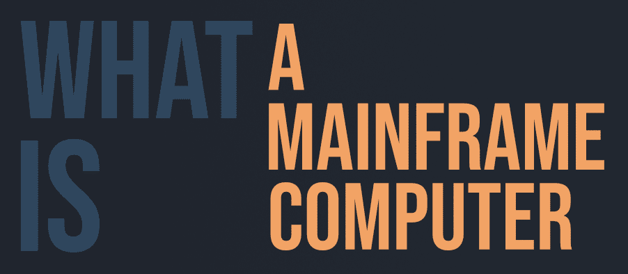

# 什么是主机？

> 原文:[https://www.geeksforgeeks.org/what-is-a-mainframe-computer/](https://www.geeksforgeeks.org/what-is-a-mainframe-computer/)

大型机是计算机的一种，是为尽可能快的**‘吞吐量’**而制造的；吞吐量可以定义为**“处理数据的速率”**。大型机也主要用于事务处理；事务可以定义为“一组操作，包括磁盘读写、操作系统调用、将数据从一个子系统传输到另一个子系统等……”

与服务器和微型计算机(如笔记本电脑、个人电脑等)相比，大型机的处理能力更强，但与超级计算机相比，处理能力更弱。
主帧的主要焦点是吞吐量，“吞吐量是处理某个东西的速率。”

#### 大型计算机的组件

大型机有两种类型的处理器，第一种是主处理器，另一种是系统辅助处理器或 SAP。思爱普处理器不处理任何数据，而是尽可能快地将数据从一个地方移动到另一个地方。
每个处理器最多可以有 7 到 10 个内核，这些内核是专门为“更高吞吐量”而设计和制造的。
每台主机最多可以有 160 个 I/O 卡。此外，他们还配备了大量的只读存储器(固态硬盘)，用于更快的数据存储和传输。

主框架有这么多输入/输出卡的事实是因为这些卡是为冗余而制造的，也就是说，如果一个卡出现故障，其他卡将接管该卡的工作负载，直到该卡被更换。

#### 为什么使用大型计算机？

主框架用于可靠性、冗余性和可用性。这些是必须的计算机，其中“0”停机时间是可以接受的。
由于这些计算机是可靠的，并且具有冗余性，即如果一个输入/输出卡由于任何原因出现故障，其工作负载将自动转移到其他输入/输出卡，从而确保“0”停机时间，这对于确保正确的交易非常重要。
同样，如果某个处理器模块出现了一些问题，那么工作负载就会转移到其他处理器上。

#### 大型机和超级计算机有什么不同？

主框架用于快速处理或“吞吐量”，而超级计算机用于数字处理，它们处理大量数据来预测天气，解决复杂的数学模型进行计算，并且主要仅用于研究。

#### 优势

*   处理速度非常快。
*   可以同时处理多个输入。
*   冗余，能够承受一个部件的故障而不影响计算机其他部分的功能。
*   始终可用，因为一旦开始，它们将在其余时间保持开启。
*   可靠性。

#### 不足之处

*   大型机不能用作普通计算机，因为它们只用于特定的任务。
*   它需要一个特殊的操作系统来运行。
*   都很贵。
*   主要用于交易处理等商业目的。
*   无法像超级计算机一样计算或解决复杂的问题。