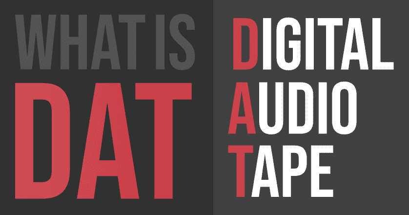

# 什么是 DAT(数字音频磁带)？

> 原文:[https://www . geesforgeks . org/what-is-datdigital-audio-tape/](https://www.geeksforgeeks.org/what-is-datdigital-audio-tape/)

DAT(数字音频磁带)是一种电子盒式磁带，具有背景录音设备和回放演唱介质。它类似于一个小型盒式磁带，但它有主要区别。早期的磁带是模拟的，但 DAT 是数字的。与标准磁带不同，数字磁带只在一个方向上工作。数据终端可以记录比光盘更高或更低的多种振动或速率。消费者很随意地接受了它，它的市场产生了适量的收入。

#### 历史

数字音频磁带是索尼公司推向市场的一种数字记录设备。当时，索尼拥有大量的开发人员和生产新电子产品的特权。因此，实际上创造数字音频磁带的想法和技术是受录像机的启发，录像机使用旋转磁头和螺旋扫描来记录数据。这些对 DAT 有着非同寻常的影响，因为扫描仪可以防止被物理编辑。数字音频磁带支持从 32 千赫到 44.1 千赫的各种模块。它还允许从 6 到 12 小时的相当广泛的记录时间范围。数字音频磁带的长度范围为 15 到 180 分钟。

数字音频磁带不是第一个数字磁带。日本已经开始使用脉冲编码调制来生产模拟唱片。但是德农产品最大的缺点是产品不是消费者制造的。这只是为了专业和测试的目的。

#### 应用程序

DAT 发布仅几天就变得非常受欢迎。人们开始学习和使用磁带。它的用途因地而异，也因情况而异。有几种情况下，数字录音带发挥了作用。
首先来说说 DAT 所属的地方，就是唱片业。该行业将这些磁带用于专业用途。数字音频磁带用于音频和所有数字制作链。这些设备与数字处理的多轨录音机和调音台相连。
这场革命只是 DAT 的开始。专业人士和音乐艺术家也开始把它带进他们的生活。从乐队艺人到个人音乐制作人，都开始在 DAT 上发布自己的唱片。
不仅数字录音带在艺术家中流行起来，音乐作曲家以及普通人和业余爱好者也开始使用这种录音带来提神。随着 DAT 将他的利润图提升到一个新的水平，人们开始使用来记录他们的声音并倾听他们。尽管价格昂贵，人们还是喜欢这些服务。赔偿是由于当时著名艺术家的唱片发行。
DAT 也开始在一个相关的科技行业发展业务。当时，存储问题是一个重大问题。但是 DAT 的作用和效率解决了这个问题。DAT 成为顺序存取介质和存储数据和信息的地方。数字音频磁带也开始作为所有技术用户的备份介质。根据标准和压缩，它有 80GB 的备份存储。

#### 那些家伙

当数字音频磁带的核心概念登陆世界及其论坛时，许多人和发明家以及技术人员开始超越 DAT 的能力进行思考。由于这些录音带有特定的弱点，高级版本试图解决这些问题。DAT 有多种型号，如 ADAT、数字音频固定头、数字数据存储、磁存储、磁带或迷你盘。

**DAT 是如何工作的？**
答案没那么难。所使用的技术是辉煌和机智的。正如我们所知，事物在不断发展，但 DAT 使用了录像机的概念。DATs 使用螺旋扫描和旋转头的概念令人印象深刻。为了实时从硬盘转换到磁带，它使用了这个概念。DAT 针对不同的情况使用了多种模式。它们的频率范围从 32 千赫到 44.1 千赫。DAT 主要致力于扩展比特率和带宽。所有风格的 DAT 都支持双通道立体声录音。数字音频磁带记录波长和振动，这些都是数字的。最后，DAT 将磁盘转换为其数字等价物，用于回放和存储。

#### 优势

*   它有更好的声音和出色的性能
*   DAT 具有非线性操作
*   它有广泛的编辑和处理工具
*   DAT 具有数据克隆的主要特征
*   它为检索和存储数据作为备份提供了出色的服务

#### 不足之处

*   这里电脑经常死机
*   数据可能因任何原因而损坏
*   还有软件安装问题
*   音质可能会有一些偏差

因此，通过观察所有选项，我们可以说 DAT 或数字音频磁带是有史以来最重大的发现。它改变了音乐产业的文化和人们的生活。