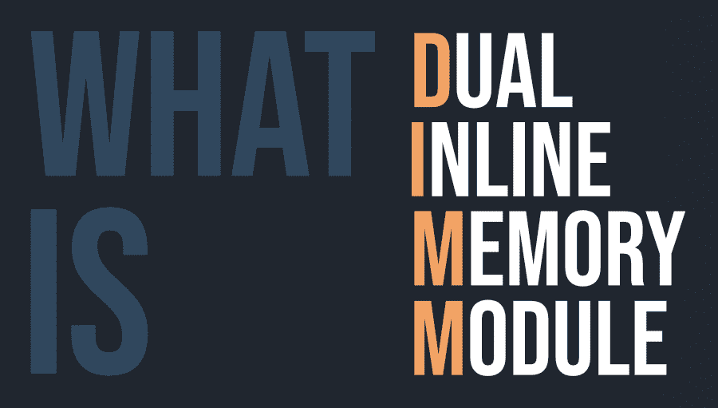
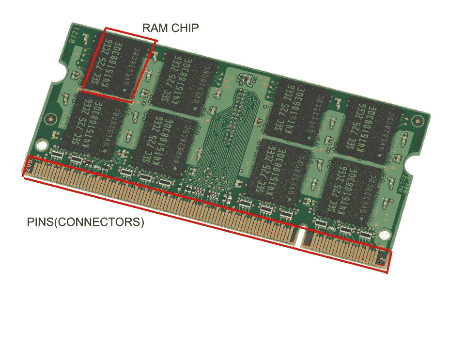

# 什么是 DIMM(双列直插式内存模块)？

> 原文:[https://www . geesforgeks . org/什么是 DIMM dual-inline-memory-module/](https://www.geeksforgeeks.org/what-is-dimmdual-inline-memory-module/)

在了解内存之前，最好先了解一下内存及其附件以及它的工作原理。

随机存取存储器是由几个电子元件组成的芯片，用于存储系统中可读写的临时工作数据。内存需要电源才能运行，因此当系统关闭时，内存中的所有数据都会消失。它安装在主板上。

由于容量较小，随机存取存储器芯片不能单独安装在主板上，因此在早期，几个芯片被焊接在一起并转换成“模块”(集成电路板)，这些模块使用“引脚”(也称为连接器)安装在主板上。

#### 模块类型

内存中有两种类型的模块:

*   单列直插式内存模块
*   双列直插式内存模块

在 SIMM 的情况下，连接器只出现在模块的一侧，并且短接在一起。SIMMs 总是以匹配对的形式使用。SIMM 提供的最大数据存储量为 32 位/周期，电压消耗为 5 伏。

随着技术的发展，SIMM 变得过时，被 DIMM 取代。DIMM 在模块的两侧(正面和背面)都有一排连接器，并且连接器是独立的。这导致内存容量是内存容量的两倍，因此支持 64 位处理器。而对于 64 位数据宽度，将并行使用两个 SIMM 棒(这是一个缺点！).内存的电压消耗为 3.3 伏，相对较低。它不是向后兼容的，也就是说，它不能在带有 SIMM 插槽的主板上使用。更换内存上损坏的内存更容易。

这证明了 DIMM cleary 在速度、延迟和功耗方面都优于 SIMM。内存通常有 168、184、214 或 244 针可供选择。

#### 内存的分类

内存可以根据缓冲区大小和内存类型进行分类:

*   **基于缓冲区大小的内存分类:**
    *   **无缓冲内存(UDIMM):** 系统无需验证直接从内存芯片读取/向内存芯片写入，因此增加了主板上的电气负载，但速度非常快。
    *   **注册内存(RDIMM):** 使用缓冲信号的寄存器，因此增加了时钟周期，但更可靠。
*   **基于内存类型的内存分类:**
    *   **SDRAM(同步动态 RAM) DIMM:** 它是第一个与系统时钟同步的动态 RAM。由于在上升半周期后重新访问数据，刷新率要低得多。
    *   **SDR(单数据速率)DIMM:** 单数据速率是指数据包每个时钟周期只被访问一次。串行数据可以通过内存上的串行数据引脚读取，这使主板能够自动配置到安装的确切类型的内存。
    *   **DDR(双倍数据速率)DIMM:** 每个时钟周期访问两次数据包。DDR DIMMs 还在每侧使用两个槽口，以支持与低轮廓和高轮廓闩锁插座的兼容性。
    *   **DDR2 DIMM:** The key difference between DDR and DDR2 is that in DDR2 the bus is clocked at twice the speed of the memory cells, so data can be transferred four times faster per memory cell cycle.

        DDR3 和 DDR4 是 DDR 的简易版本，延迟更少，准确性更高。SODIMM(小外形 DIMM)压缩程度更高，尺寸明显缩小，可用于便携式设备。

#### 如何选择合适的内存？

从微型 ATX 到标准主板，内存大小各不相同，因此引脚数量是一个重要因素。在购买内存棒时，评级就像 16 GB 内存可以是 1X16GB(每个内存 1 个内存和 16GB 内存)、2X8GB(每个内存 2 个内存和 8GB 内存)或 4X4GB(每个内存 4 个内存和 4GB 内存)。还应考虑工作频率和最大超频频率。