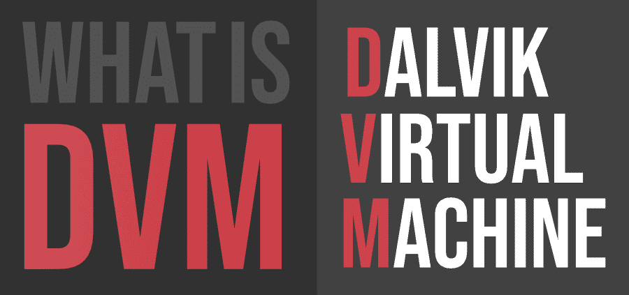
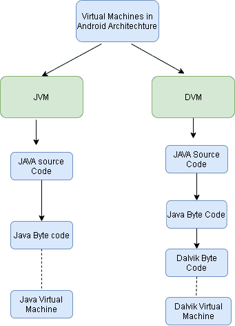

# 什么是 DVM(达尔维克虚拟机)？

> 原文:[https://www . geesforgeks . org/what-is-dvmdalvik-virtual-machine/](https://www.geeksforgeeks.org/what-is-dvmdalvik-virtual-machine/)

达尔维克虚拟机是一个基于注册的虚拟机。作为安卓手机平台的一部分，它是由丹·博恩施泰因和其他谷歌工程师共同设计和编写的。达尔维克虚拟机是以博恩施泰因的名字命名的，以他的一些祖先曾经居住的冰岛埃亚菲厄的渔村“达尔维克”命名的。

#### DVM 的工作原理

Java 编译器将 Java 源代码转换成 Java 字节码。类)。然后 DEX 编译器将此转换为()。类)文件，即。dex "文件。

#### 应用

对于安卓，如上所述，谷歌开发了一个新的虚拟机。它使用中央处理器的寄存器来存储操作数。所以不需要任何指令的推动和弹出。从而加快执行速度。指令对虚拟寄存器进行操作，这些虚拟寄存器是主机设备中的存储位置。基于寄存器的模型擅长优化和在低内存上运行。它们可以存储共同的子表达式结果，以便将来再次使用。这在基于堆栈的模型中根本不可能。达尔维克虚拟机使用自己的字节码并运行”。dex "(达尔维克可执行文件)文件。

#### 优势

*   DVM 只支持安卓操作系统。
*   在 DVM 中可执行的是 APK。
*   执行速度更快。
*   从安卓 2.2 SDK 达尔维克有自己的 JIT(准时)编译器。
*   DVM 的设计使得一个设备可以有效地运行虚拟机的多个实例。
*   应用程序有自己的实例。

#### 不足之处

*   DVM 只支持安卓操作系统。
*   对于数字视频管理，只有很少的重新工具可用。
*   需要比注册机器更多的指令来实现相同的高级代码。
*   由于 dex，应用程序安装需要更多时间。
*   需要更多的内部存储。