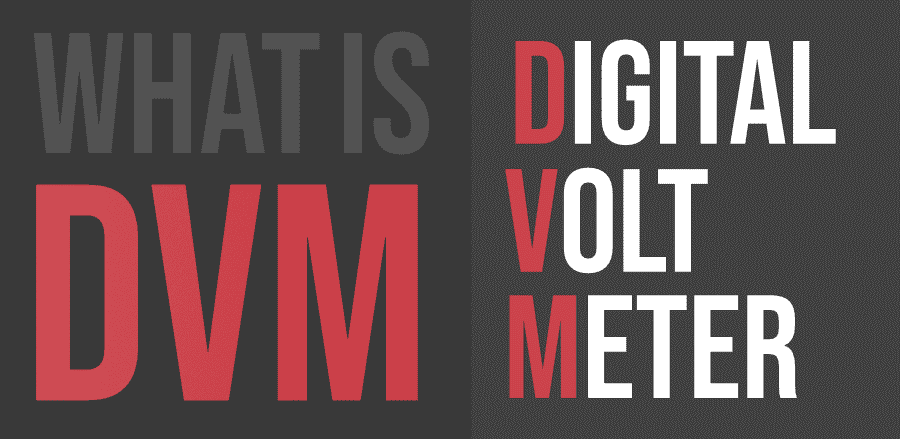

# 什么是 DVM(数字电压表)？

> 原文:[https://www . geesforgeks . org/what-is-dvm digital-volt-meter/](https://www.geeksforgeeks.org/what-is-dvmdigital-volt-meter/)

随着人类需求的扩大和增长，为我们制造和设计了不同的商品和商品来满足这些需求。我们今天使用的大多数东西都需要电力来运行，因此，数字电压表的作用在这方面变得更加重要。顾名思义，数字电压表用于测量各种电器(如空调、计算机等)运行和工作时的电压。我们还需要一个数字电压表，以便我们可以相应地规划我们的能源消耗。因此，数字电压表使我们能够规划我们的财务和电力消耗。

#### 历史

1954 年，非线性系统公司的安德鲁·凯设计了世界上第一台数字电压表。安德鲁·凯在为一家名为杰克和赫尼茨的公司工作时，获得了这个想法的灵感，这个灵感来自最不可能的来源。他见过困扰非熟练生产线工人的麻烦，他们诅咒自己的命运，因为他们不得不使用大型模拟电压表来做同样的事情。此外，这些工人不擅长处理电压读数，经常通过炸东西的方式搞砸。此外，大型模拟电压表非常昂贵，使用起来也不方便。这也为后勤问题创造了空间。第一个数字电压表使用机械斩波器在电阻分压器和电池组之间切换。第一台商用数字电压表的特点是四位数的精确电压显示，提供精确到小数点后一位的读数。

#### 特征

*   数字电压表用于测量电器消耗的交流或 DC 电压，并以数字形式直接显示该值，而不是使用指针偏转。
*   因此，它是一个电压敏感器件。它通过首先将模拟电压转换为数字电压，然后使用转换器以数字格式显示来测量输入电压。
*   数字电压表通常围绕一种特殊类型的模数转换器设计，这种转换器通常被称为积分转换器。
*   通常，数字电压表的输入范围为 1V 至 1000V。

#### 数字视频媒体的类型

市场上可用的各种类型的数字电压表包括斜坡式数字电压表、交互式电压表、连续平衡数字电压表、电位计数字电压表和逐次逼近数字电压表。所有这些不同类型的电压表都有自己不同的规格，可用于各种需求。

#### 优势

*   首先，它们消除了困扰早期系统的人为错误，因此，与模拟仪表相比，数字电压表提供的读数更准确、更快速。
*   其次，数字电压表比早期系统更稳定，因此更可靠。他们可以测量交流和 DC 电压系统。
*   第三，市场上可用的先进数字电压表由微控制器构成，确保读数也能存储起来以备将来参考和处理。

#### 不足之处

*   如果电压增加超过特定的限度，数字电压表必然会损坏或出现故障。
*   此外，作为一台机器，它依赖于电力甚至电池形式的外部电源。
*   尽管数字电压表有惊人的读取电压的能力和使能效果，但它很难读取瞬态电压尖峰。
*   除此之外，数字电压表的数字化电路也限制了运算速度。

然而，尽管困难重重，数字电压表还是让许多人的生活变得轻松起来，说包括今天生活的每一个人也不为过。这无疑大大简化了我们开展业务的方式。事实上，数字电压表会和我们一样长久地存在——它已经深深地扎根于我们的集体之中。