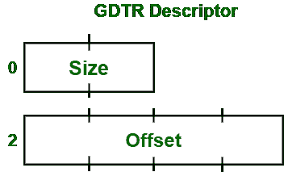
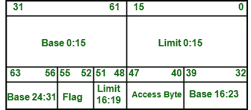
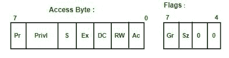

# 什么是全局描述符表

> 原文:[https://www . geesforgeks . org/什么是全局描述符表/](https://www.geeksforgeeks.org/what-is-global-descriptor-table/)

**全局描述符表:**

*   全局描述符表是一种**数据结构，由英特尔 x86 系列处理器从 80286 开始使用，用于定义程序执行期间使用的各种内存区域(段)的特征，包括大小、基址以及写和可执行等访问权限。**
*   **英特尔公司是一家美国科技公司和跨国公司。它的总部设在加州圣克拉拉的硅谷。英特尔公司是世界上最大的半导体芯片制造商。它还开发 x86 系列微处理器。**
*   **x86 是一系列微处理器，存在于大多数个人电脑(PCs)中。**
*   **英特尔 80286 也被称为iAPX 286[4]或英特尔 286 **。**是 1982 年 2 月 1 日推出的 16 位微处理器。这是第一个基于 8086 的中央处理器，它有独立的数据总线和非多路复用的地址。它也是第一个具有内存管理和广泛保护能力的中央处理器。**

****结构:**
确切地说，在保护模式下，在英特尔架构中，中断服务例程和内存管理本质上是由描述符表管理的。例如，每个描述符保存关于单个对象的信息；一个任务、一个服务例程、一部分数据或代码等，CPU 在某个时间可能需要这些数据或代码。如果有人试图在段寄存器中填充一个新值，那么中央处理器需要执行安全和访问控制检查，看看你是否被允许访问指定的内存区域。如果这些检查成功执行，那么有用的值将被缓存在中央处理器的不可见寄存器中。英特尔代表以下三种类型的表格。**

1.  **中断描述符表(取代 IVT)**
2.  **全局描述符表(GDT)**
3.  **本地描述符表(LDT)**

****注–**
以上所有表都表示为一个线性地址，大小由 LIDT、LGDT、LLDT 指令按顺序给 CPU。在大多数情况下，操作系统会在引导时直接通知这些表在哪里，然后很明显，操作系统会通过指针来写入或读取这些表。**

****GDT 概述:**
全局描述符表携带了告诉中央处理器内存段的条目。这是 IA32 架构所特有的。**

****构图:**
在这里，我们将一步步了解 GDT 的构图如下。
**步骤-1 :**
通过使用 LGDT 装配指令，GDT 被装载。它寻找 GDT 描述的一个结构的位置。：**

**

**GDTR**** 

****Step-2 :**
这里的 Offset 是描述符表的线性地址，意思是分页适用，这里的 Size 是描述符表的大小减去 1。描述符表的大小减去 1，因为 65535 是大小的最大值，但是 GDT 最多只能是 65536 个字节(这意味着条目最多可以是 8192 个)。此外，没有一个 GDT 可以携带 0 的大小。**

****步骤 3:**
GDT 包含 8 字节的条目，每个条目都有如下复杂结构。**

**

**GDT 入境**** 

****步骤-4 :**
这里，限制 0:15 表示字段携带 0-15 位的限制值。基数有 32 位值，包含从段开始的线性地址，此处 20 位值表示最大可寻址单位(单位为 1 字节或以页为单位)。因此，如果有人选择了 4 KiB 这样的页面粒度，然后将限制值设置为 0 × FFFFF，那么这里的段长度将为 4 GiB 地址空间。下面是标志和访问字节的组成，如下所示。**

**

**GDT 位**** 

****第 5 步:**
**符号描述–****

*   ****Pr–**
    表示现在位。对于所有有效扇区，该值应为 1 位。**
*   ****privil–**
    意思是特权。它应该包含 2 位和环级别，其中 0 =最高(内核)和 3 =最低(用户应用程序)。**
*   ****S–**
    表示描述符类型。它必须为数据段或代码设置，对于系统段(例如，任务状态段)应该为空。**
*   ****Ex–**
    表示可执行位。如果 Ex 是 1，则可以执行该段中的代码(即代码选择器)，如果 Ex 是 0，则它是数据选择器。**
*   ****DC–**
    意为方向位，也称符合位。它告诉方向。如果 DC = 0，则线段增大，如果 DC = 1，则线段减小(意味着限制小于偏移)。**

****第 6 步:**
**代码选择器的一致性位–**
如果给定段中的 1 个代码是从同等或更低的权限级别执行的。例如，环 3 中的代码远跳至环 2 段中的一致性代码。privl 位显示允许执行该段的最高特权级别。例如，环 0 中的代码不能跳转到 privl == 0 × 2 的一致性代码段，但环 2 和环 3 中的代码可以做到这一点。因此，权限级别保持不变，即从环 3 到 privl == 2 的远跳—跳后段仍保留在环 3 中。如果为 0，则该段中的代码只能从 privl 中的环集中执行。**

****Step-7 :**
**符号描述–****

*   ****RW–**
    表示可读位或可写位。**

1.  ****代码选择器的可读位:**
    以防允许对此段进行读访问。代码段永远不允许写访问。**
2.  ****数据选择器的可写位:**
    以防允许对此段进行写访问。数据段始终允许读取访问。**

*   ****Ac–**
    表示访问位。将其设置为 0。当访问该段时，中央处理器将其设置为 1。**
*   ****Gr–**
    表示粒度位。如果为 0，则限制在 1 个 B 块(字节粒度)，如果为 1，则限制在 4 个 KiB 块(页面粒度)。**
*   ****Sz–**
    表示大小位。如果为 0，选择器定义 16 位保护模式。如果为 1，选择器定义 32 位保护模式。我们可以同时拥有 16 位和 32 位选择器。**

****在 GDT 保存的物品:**
为了保持平衡，人们应该始终在 GDT 保存以下物品，如下所示。**

*   **处理器根本没有引用空描述符。一些仿真器(如 Bochs)会抱怨限制中的异常。该描述符还用于存储指向 GDT 本身的指针(与 LGDT 指令一起使用)。指针是 6 字节宽，空描述符是 8 字节宽。因此，GDT 可能是最适合的地方。**
*   **一个 TSS 段描述符(至少保留一个位置)。**
*   **数据段描述符(我们不能写入代码段，因此，我们用 type = 0 × 92 添加它)。**
*   **代码段描述符(对于内核，它必须具有类型= 0 × 9A)。**
*   **如果我们需要，可以为更多细分市场留出空间(例如，低密度聚乙烯、用户级、更多技术支持服务等。).**