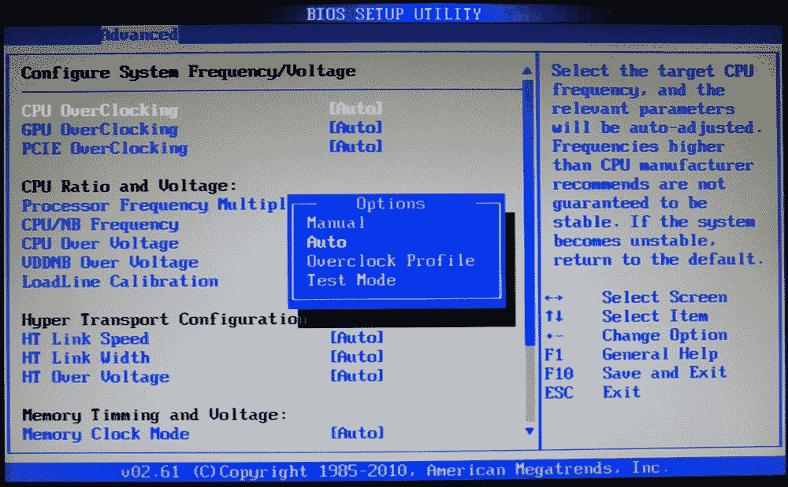

# 什么是超频？

> 原文:[https://www.geeksforgeeks.org/what-is-overclocking/](https://www.geeksforgeeks.org/what-is-overclocking/)

在计算机领域，超频是指提高计算机组件(如处理器、 [RAM](https://www.geeksforgeeks.org/different-types-ram-random-access-memory/) 等)时钟速率的行为。

在本文中，我们将讨论处理器的超频。

例如，如果您有一个基础时钟为 2.91 千兆赫的处理器，那么，让它以高于 2.91 千兆赫的时钟速率运行将被称为超频。

如今，由于设计组件的复杂工程，超频任何给定的组件都非常容易。显卡、处理器、内存模块、显示器、PCI express 插槽、主板等。所有这些组件现在都带有超频功能。

**超频一个 CPU :**
超频过程从系统的 bios 开始；不同的制造商有不同的 bios，但最终它们都生产出相同的产品。
一般有免跳线配置/CPU 超频的选项，只需点击它，就会到达一个窗口，在这里你必须输入新的时钟速率，如果需要，还可以在限制内调整电压，以免给 CPU 造成压力，使其被吹掉。

此外，对于超频，建议使用良好的中央处理器冷却器来保持最佳温度，并且在此过程中不会损坏零件。
同样，我们也可以超频 RAM、GPU 和 Monitors。是的，如果显示器具有超频功能，我们还可以超频显示器以获得更多的帧速率。

**到底该不该做:**
嗯，超频也有很多利弊。

**优点–**

1.  您可以获得更高的时钟速率，从而提高处理速度。
2.  更快的计算机性能。
3.  您将能够从现有电脑中获得更多性能，而无需花费一分钱。

**cons–**

1.  如果超频，产品保修无效。
2.  产品的整体寿命将会缩短。
3.  如果超频超过某些特定限制，产品可能会损坏或失效。

总结这篇文章，超频到一个小的时钟速率，不超过极限或者过度其实是有益的。如果你试图超频并且你的中央处理器被损坏，我不承担任何责任，这篇文章只用于教育目的。