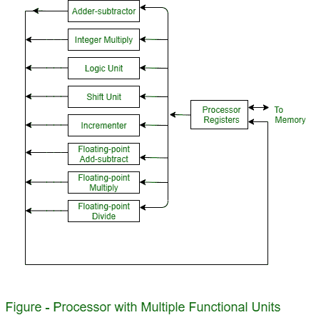

# 什么是并行处理？

> 原文:[https://www.geeksforgeeks.org/what-is-parallel-processing/](https://www.geeksforgeeks.org/what-is-parallel-processing/)

为了提高计算机系统的计算速度，用于同时进行数据处理操作的术语“**并行处理**被用来表示一个大类。此外，并行处理系统能够并行处理数据，以实现更快的执行时间。

例如，当一条指令在算术逻辑单元中执行时，可以从内存中读取下一条指令。系统可以有两个或多个算术逻辑单元，并且能够同时执行两个或多个指令。此外，两个或两个以上的处理也用于加快计算机处理能力，并随着并行处理而增加，随之而来的是系统成本的增加。但是，技术发展已经将硬件成本降低到并行处理方法在经济上可行的程度。

并行处理源于多层次的复杂性。它通过在最低级别使用的寄存器类型来区分并行和串行操作。[移位寄存器](https://www.geeksforgeeks.org/shift-registers-in-digital-logic/)以串行方式一次工作一位，而并行寄存器同时工作，所有位与字的所有位同时工作。在高度复杂的情况下，并行处理源于具有多个同时执行独立或相似操作的功能单元。通过在几个功能单元之间分配数据，安装了并行处理。

例如，算术、移位和逻辑运算可以分为三个单元，并且运算在控制单元的监督下被转换成示教单元。

将执行单元分成并行运行的八个功能单元的一种可能方法如图所示。根据指令指定的操作，寄存器中的操作数被转移到与操作数相关联的一个单元。在每个功能单元中，所执行的操作在图的每个块中表示。整数的算术运算由加法器和整数乘法器完成。

[浮点运算](https://www.geeksforgeeks.org/floating-point-representation-basics/)可以分为三路并行运算。对不同的数据同时执行逻辑、移位和增量操作。所有单位都是相互独立的，因此一个数字被移位，而另一个数字被递增。通常，多功能组织与一个复杂的控制单元相关联，以协调几个组件之间的所有活动。

并行处理的主要优点是，它通过增加资源多样性来提高系统总吞吐量，从而更好地利用系统资源。