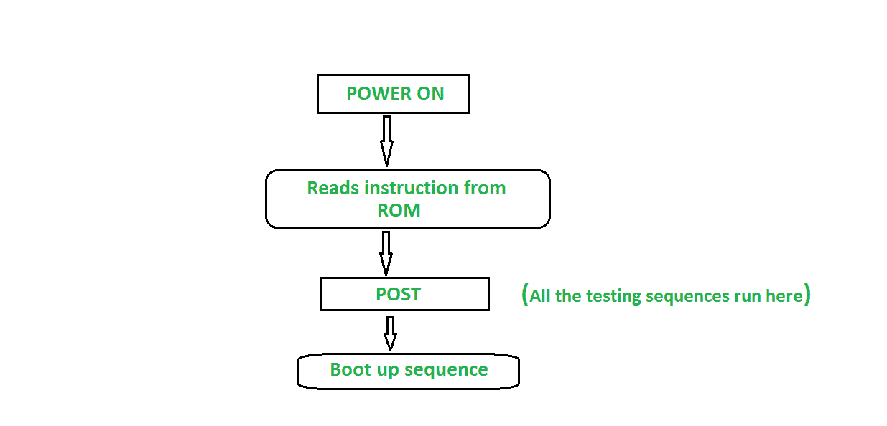

# 什么是开机自检？

> 原文:[https://www.geeksforgeeks.org/what-is-post/](https://www.geeksforgeeks.org/what-is-post/)

**开机自检:**
当系统开机时，计算机的 BIOS(基本输入/输出系统)运行一些称为开机自检的诊断测试序列。这些测试旨在检查随机存取存储器、硬盘驱动器和所有其他所需的外围设备(如鼠标、键盘等)是否正常工作。如果出现任何错误或故障，它们会在显示屏上或以编码蜂鸣音的形式向系统发出警告。编码蜂鸣模式包含关于检测到的问题的信息。开机自检是自动的，因为它们总是在系统开机后自动运行。当测试序列结束并且发现一切正常时，系统将进入引导过程。

#### 开机自检的优点

*   **自动测试序列:**开机自检是自动的，因此不需要额外的命令来运行它们，它们在打开系统后立即在系统上自动运行。
*   **作为安全功能:**开机自检作为系统的安全功能，如果发现任何故障，它会在启动系统之前发出警告。
*   **速度快:**开机自检的测试序列运行时间很短。
*   **有助于故障检测:** POST 给出问题的警告和产生问题的设备名称，这使得检测问题变得容易。

#### 开机自检的缺点:

*   开机自检的唯一主要缺点是，它只检查系统的内部功能，不测试外部接口逻辑。