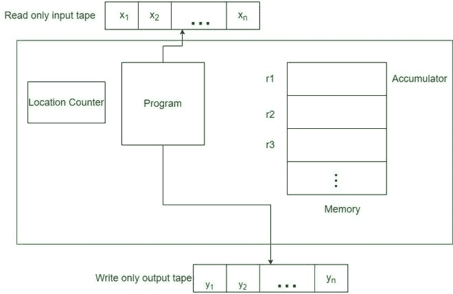

# 什么是随机接入机？

> 原文:[https://www . geesforgeks . org/什么是随机访问机器/](https://www.geeksforgeeks.org/what-is-random-access-machine/)

在顺序计算机上解决问题所需的算法称为**顺序算法**。为在并行计算机上解决问题而编写的算法被称为**并行算法**。顺序算法以步骤的形式编写，由 PE 按顺序完成，即顺序算法使用顺序步骤来解决问题。在并行算法中，我们必须看到通信发生在哪里，我们必须移动特定步骤的输出。

[为特定架构编写的算法](https://www.geeksforgeeks.org/introduction-to-algorithms/)不能应用于另一个架构，换句话说，要在不同的并行计算机上解决同一个问题，必须基于并行计算机架构编写不同的算法。

编写并行算法是一项复杂的任务，为了解决这个问题，假设设计了各种称为抽象机器的并行模型。

**抽象机器**只是想象出来的概念，在现实中并不存在。在这里我们可以做出推论来解决问题。

**抽象机有两种**

*   随机存取存储器
*   [并行随机存取机(PRAM)](https://www.geeksforgeeks.org/pram-or-parallel-random-access-machines/)

#### 随机存取存储器

随机存取机器或内存模型是一个中央处理器。它是一个潜在的非绑定存储单元库，每个存储单元可以包含任意数量或任意字符。内存单元是有编号的，访问内存中的任何单元都需要时间，或者说所有操作(从内存中读取/写入、标准算术和布尔运算)都需要一个时间单位。RAM 是计算的标准理论模型(无限内存和相等的访问成本)。随机存取机器模型对计算机行业的成功至关重要。

随机存取机

*   随机存取机器(RAM)模型是一个地址的计算机。
*   内存是一个顺序机器。RAM 由内存、只读输入带、只读输出带组成，并编写程序。
*   程序没有存储在内存中，不能修改。
*   输入磁带由一系列整数组成。每次读取输入值时，输入头向前移动一个方块。
*   同样，输出磁头在每次写入后向前移动。存储器由一个无限序列的寄存器组成，指定为 r0，r1，r2，…
*   每个寄存器可以包含一个整数。寄存器 r0 是累加器，计算在这里完成。
*   随机存取存储器必须具有与加载、存储、读取、写入、加法、减法、乘法、除法、测试、跳转和暂停相同的指令。
*   RAM 程序的最坏情况时间复杂度函数是 f(n)，这是程序在所有 n 大小的输入上执行所花费的最大时间。
*   我们假设这些步骤中的每一步都取一个常数，即 O(1)时间。

在内存中，算法的每一步都由以下步骤组成:

*   **读取**:(最多)N 个处理器同时(并行)从 N 个内存位置(如内存中)读取，并将值存储在其本地寄存器中。
*   **计算**:(最多)N 个处理器对其寄存器中的值执行基本的算术或逻辑运算。
*   **写入**:(最多)N 个处理器同时从其寄存器向(最多)N 个存储位置写入。

在内存的情况下，每个步骤，读取、计算、写入，都需要 0(1)时间。应当注意，并非所有处理器都需要执行算法的给定步骤。当一个处理器子集迈出一步时，其他处理器在此期间保持空闲。PRAM 的算法必须指定在一个阶段的执行期间哪个处理器子集应该是活动的。