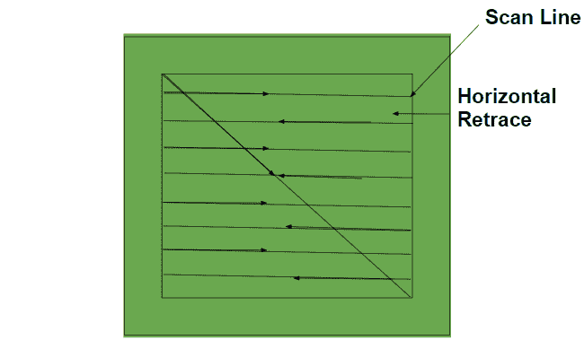

# 什么是光栅扫描显示机制？

> 原文:[https://www . geesforgeks . org/什么是光栅扫描显示机制/](https://www.geeksforgeeks.org/what-is-raster-scan-display-mechanism/)

计算机图形学是以图像的方式对图像进行处理。渲染可以在新图像的操作和创建中完成，因此使用计算机图形。即使是光栅扫描也是计算机图形学的一个重要方面。

光栅扫描显示器是采用阴极射线管的最常见的图形监视器。它基于电视技术。

#### 光栅扫描显示器的工作

*   在光栅扫描系统中，电子束被用作屏幕上的固定路径。电子豆从屏幕的左上角开始，沿着水平路径，直到到达线的末端。这定义了扫描线。在扫描过程中，光束的强度根据沿着该线的所需图像的图案进行调制。
*   到达屏幕的右上角后，光束被关闭，并移回到新行的左边缘/点作为新的起点。这定义了水平回扫。
*   图像清晰度位于技术上称为帧缓冲区的存储区域。该存储区域保存所有屏幕点的一组强度值。然后从帧缓冲器中检索存储的强度值，并用于在屏幕上显示图像。
*   现在继续扫描，直到到达屏幕右下角。到达屏幕右下角后，它定义一次扫描完成。每个屏幕点被称为一个像素。
*   一次扫描完成后，电子束被重新定位在屏幕的左上角，用于下一次扫描。电子束右下角到左上角的重新定位过程称为垂直回扫。

该图如下所示:

#### 优势

*   光栅扫描设备的成本更低。
*   不需要智能电子束。
*   用于动画目的。

#### 不足之处

*   低分辨率。
*   需要更多内存。
*   电子束与整个屏幕相协调，而不仅仅是与屏幕上要画图像的部分相协调。