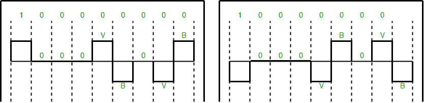
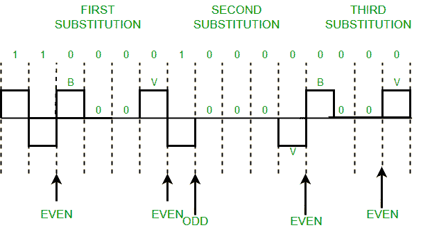

# 什么是数字电子中的加扰？

> 原文:[https://www . geeksforgeeks . org/什么是数字电子中的加扰/](https://www.geeksforgeeks.org/what-is-scrambling-in-digital-electronics/)

先决条件–[块编码](https://www.geeksforgeeks.org/digital-electronics-block-coding/)、[线编码](https://www.geeksforgeeks.org/digital-electronics-difference-unipolar-polar-bipolar-line-coding-schemes/)、
计算机网络被设计成将信息从一个点发送到另一个点。我们发送的数据可以是数字的，也可以是模拟的。代表数据的信号也可以是数字的或模拟的。
因此，要使用信号发送数据，我们必须能够将数据转换为信号。这种转换可以是模拟到模拟、模拟到数字、数字到模拟或数字到数字。

数字到数字转换涉及三种技术——行编码、块编码和加扰。[始终需要行编码](https://www.geeksforgeeks.org/digital-electronics-difference-unipolar-polar-bipolar-line-coding-schemes/)，而[块编码](https://www.geeksforgeeks.org/digital-electronics-block-coding/)和加扰可能需要，也可能不需要，这取决于需要。

**加扰**是一种不增加比特数并且提供同步的技术。双极反转(交替标记反转)等技术问题是连续的零序列会产生同步问题。解决这个问题的一种方法是加扰。

有两种常见的加扰技术:

1.  B8ZS(双极 8-零替换)
2.  高密度双极晶体管 3-零

**B8ZS(双极带 8-零替换)–**
这种技术类似于双极 AMI，只是当遇到八个连续的零电平电压时，它们被序列“000VB0VB”替换。
**注–**

*   v(违例)，是一个非零电压，这意味着信号与先前的非零电压具有相同的极性。因此，它违反了一般的急性心肌梗死技术。
*   b(双极性)，也是符合 AMI 规则的非零电压电平(即与先前的非零电压极性相反)。

示例:数据= 100000000

**注意–**两个数字(左右一个)都是正确的，这取决于前一个数据序列(即当前数据序列“100000000”之前的序列)的最后一个非零电压信号。

**HDB3(高密度双极性 3-零)–**
在这种技术中，四个连续的零电平电压被替换为序列“000 伏”或“B00 伏”。

使用这些序列的规则:

*   如果最后一次替换后的非零脉冲数为奇数，替换模式将为“000 伏”，这有助于保持非零脉冲总数为偶数。
*   如果最后一次替换后非零脉冲数为偶数，则替换模式为“B00V”。因此，偶数个非零脉冲再次被保持。

示例:数据= 110000100000000

**解释–**在表示数据的前两个 1 之后，我们遇到四个连续的 0。因为我们最后的替换是两个 1(因此非零脉冲的数量是偶数)。所以，我们用“B00V”代替四个零。

**注–**零非零脉冲也是偶数。

**参考文献-**
[数据通信与网络](https://amzn.to/3qpKcbH)作者:贝鲁兹·弗鲁赞(图书)