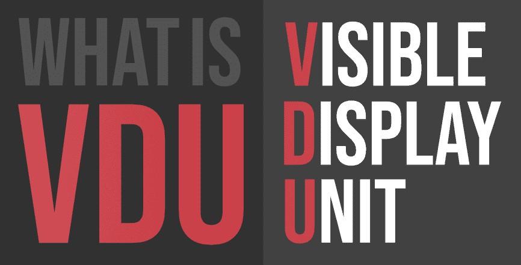

# 什么是 VDU(可视显示单元)？

> 原文:[https://www . geesforgeks . org/what-is-v duvisible-display-unit/](https://www.geeksforgeeks.org/what-is-vduvisible-display-unit/)

**VDU** 是一个更为老练的英国术语，用来描述任何与计算机一起使用来显示内容和图片的小工具。例如，平板显示器和投影仪都是视频显示器的插图。在任何情况下，视频显示器最常用于描绘阴极射线管屏幕，这是一个目前已经被发光二极管等平板显示策略取代的古老标准。

#### 历史

早期的视频显示器基本上是阴极射线管显示器，并且通常具有 13 英寸或更小的拐角估计。20 世纪 90 年代，15 英寸和 17 英寸的节目成为标准，一些制作人开始制作超过 20 英寸的节目。在世纪之交，平板显示变得更加普遍，到 2006 年，阴极射线管显示很难找到。如今，计算机通常配备估计为 20 英寸到 30 英寸的视频显示器。由于液晶显示器、等离子显示器和发光二极管创新的发展，制造大尺寸屏幕比最近一段时间付出的代价更令人信服。

#### 视频显示器的类型

*   **液晶显示器**
    液晶是流体材料，具有晶体的一些光学特性。一场由液晶构成的表演就像一簇小阴影，可以透射光线或使光线呈方形。一种被称为背景照明的闪亮光源，布置在液晶显示屏的后面，在液晶显示屏上闪闪发光，形成数以千计的红色、蓝色和绿色，构成一幅彩色图像。
*   **阴极射线管**
    上世纪 90 年代的某个时候，几乎所有的电脑节目、电视机和视频屏幕都利用了阴极射线管的创新。阴极射线管可能是一个厚玻璃真空管，其结论之一可能是内部有磷光涂层的平滑屏幕。在真空中，一条来自热金属纤维的电子在屏幕的反方向撞击磷光体，产生一种光亮。一个电子控制元件扭曲了柱子，使它在屏幕上上下检查，“描绘”出一系列清晰的画面。尽管阴极射线管创造了高质量的图像，但液晶显示器和其他未使用的创新产品更轻、更安全，并已导致阴极射线管的过时。
*   **等离子屏幕**
    等离子屏幕通过用高能电子柱点亮数千个适度的点(或“像素”)来产生高分辨率的图像。等离子体结合了三个像素的颜色(红色、绿色和蓝色)来形成整个颜色范围，比液晶显示器或阴极射线管显示器的颜色更丰富。等离子电视通常是非常大的宽屏电视，但也有许多等离子电视可以用作电脑节目。尽管它们比液晶显示器更大更重，但等离子体在很大程度上是因为它们几乎有 6 英寸厚。等离子体显示装置通常会略微增加能量。

#### 优势

*   视频显示器通常不会特别贵。
*   它具有良好的质量分辨率。
*   它具有动画功能
*   可变色彩能力几乎无限运行。
*   现在的视频显示器更纤细，意味着空间更小。

#### 不足之处

*   影响角色估计和限制可行视距的受限屏幕措施。
*   屏幕很精致，当然清洁时要小心。