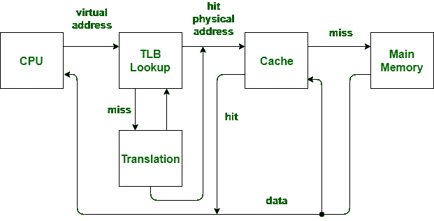

# CPU 缓存和 TLB 有什么区别？

> 原文:[https://www . geeksforgeeks . org/CPU 缓存和 tlb 的区别是什么/](https://www.geeksforgeeks.org/whats-difference-between-cpu-cache-and-tlb/)

中央处理器高速缓存和 TLB 都是微处理器中使用的硬件，但有什么区别，尤其是当有人说 TLB 也是高速缓存的一种类型时？

首先。 **CPU 缓存**是一种快速内存，用于改善从主内存(RAM)获取信息到 CPU 寄存器的延迟。所以中央处理器高速缓存位于主内存和中央处理器之间。并且该缓存临时存储信息，以便下一次访问相同的信息更快。用于存储可执行指令的中央处理器高速缓存，称为指令高速缓存。中央处理器缓存用于存储数据，它被称为数据缓存。因此，I 缓存和 D 缓存分别加快了指令和数据的提取时间。现代处理器包含输入缓存和输出缓存。为了完整起见，让我们也讨论一下 D 缓存层次结构。数据缓存通常以层次结构组织，即一级数据缓存、二级数据缓存等。应该注意的是，与 L2 数据缓存相比，L1 数据缓存速度更快/更小/成本更高。但是“*中央处理器缓存*的基本思想是加快从主内存到中央处理器的指令/数据提取时间。

**仅当处理器使用虚拟内存时，才需要转换后备缓冲区(即 TLB)** 。简而言之，TLB 通过在更快的内存中存储页表，加快了虚拟地址到物理地址的转换。事实上，TLB 也位于中央处理器和主存储器之间。准确地说，当虚拟地址需要转换为物理地址时，MMU 使用 TLB。通过将这种虚拟-物理地址的映射保存在快速内存中，可以提高对页表的访问。应该注意的是，页表(它本身存储在内存中)跟踪虚拟页在物理内存中的存储位置。从这个意义上说，TLB 也可以被认为是页表的缓存。

但是 *TLB* 和 *CPU Cach* e 的操作范围不同。TLB 是关于“加速虚拟内存的地址转换”，这样就不必为每个地址访问页表。中央处理器高速缓存是关于“加快主内存访问延迟”，这样内存就不会总是被中央处理器访问。TLB 操作发生在 MMU 进行地址转换的时候，而 CPU 缓存操作发生在 CPU 访问内存的时候。事实上，任何现代处理器都部署了所有的 I-Cache、L1 & L2 D-Cache 和 TLB。

如果你觉得以上有用，请做喜欢/分享。此外，请给我们留下进一步澄清或信息的评论。我们很乐意帮助和学习🙂