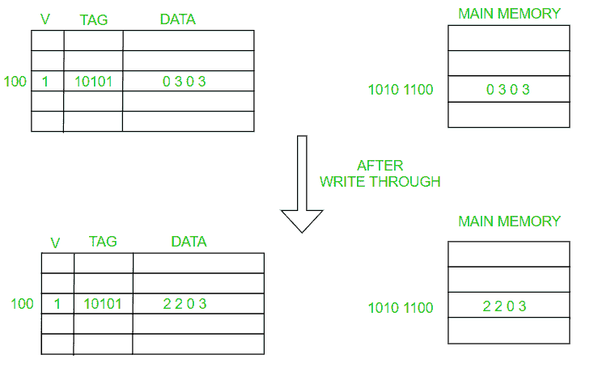
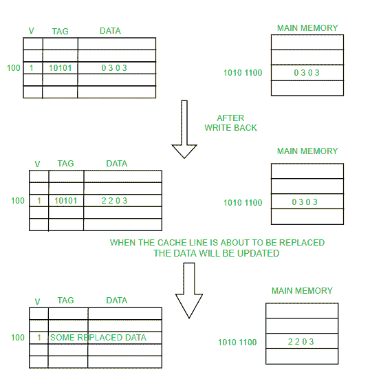
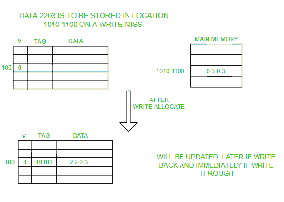
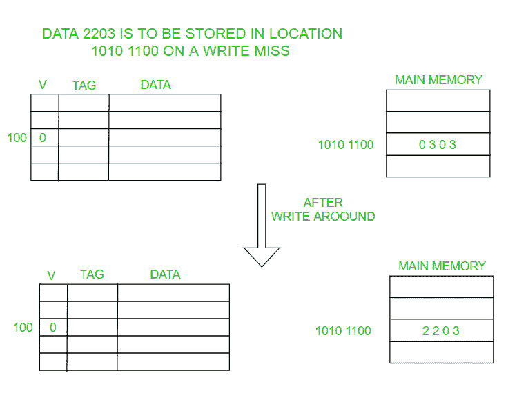

# 直写和回写缓存

> 原文:[https://www . geesforgeks . org/直写回写缓存/](https://www.geeksforgeeks.org/write-through-and-write-back-in-cache/)

先决条件–[多级缓存组织](https://www.geeksforgeeks.org/multilevel-cache-organisation/)
[缓存](https://www.geeksforgeeks.org/cache-memory-in-computer-organization/)是一种将数据副本临时存储在快速访问存储内存中的技术。缓存将最近使用的单词存储在小内存中，以提高数据访问速度。它充当内存和中央处理器之间的缓冲区，从而提高处理器获得数据的速度。

每当处理器想写一个字时，它会检查它想写数据的地址是否在缓存中。如果地址存在于缓存中，即**写命中**。

我们可以更新缓存中的值，避免昂贵的主内存访问。但这导致了**数据不一致**的问题。由于高速缓存和主存储器具有不同的数据，这将导致共享主存储器的两个或更多设备出现问题(如在多处理器系统中)。
这就是**写通**和**写回**进入画面的地方。

**<u>直写:</u>**

在直写中，数据被**同时更新到缓存和内存**。这个过程更简单、更可靠。当没有频繁写入缓存时(写入操作的数量较少)，会使用此选项。

它有助于数据恢复(在停电或系统故障的情况下)。数据写入将经历延迟，因为我们必须写入两个位置(内存和缓存)。它解决了不一致的问题。但是它质疑在写操作中使用高速缓存的优势(因为使用高速缓存的全部目的是避免对主存储器的多次访问)。

**<u>回写:</u>**

数据仅在高速缓存中更新，并在以后更新到内存中。只有当高速缓存行准备好被替换时，数据才会在内存中更新(高速缓存行替换是使用贝拉蒂的异常、最近最少使用算法、先进先出、后进先出和其他取决于应用的方法来完成的)。
写回也称为写延迟。

**脏位**:缓存中的每个块都需要一个位来指示缓存中存在的数据是被修改了(脏)还是没有被修改(干净)。如果它是干净的，就没有必要把它写入内存。它旨在减少对内存的写操作。如果**缓存出现故障**或者**系统出现故障或者**断电，修改后的数据将会丢失。因为如果数据丢失，几乎不可能从缓存中恢复数据。

如果写操作发生在缓存中不存在的位置(写未命中)，我们使用两个选项，**写分配**和**写绕过**。

**<u>写分配:</u>**

在写分配中，数据从内存加载到缓存中，然后更新。写分配适用于回写和直写。但是它通常与写回一起使用，因为它不需要将数据从内存带到缓存，然后更新缓存和主内存中的数据。因此，直写通常与无写分配一起使用。

**<u>写在身边:</u>**

在这里，数据被直接写入/更新到主存储器，而不干扰高速缓存。当数据没有立即再次使用时，最好使用这个。