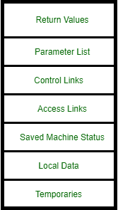
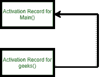

# 接入链路和控制链路

> 原文:[https://www . geesforgeks . org/access-link-and-control-link/](https://www.geeksforgeeks.org/access-links-and-control-links/)

在本文中，我们将解释访问链接和控制链接。嗯，都在[激活记录](https://www.geeksforgeeks.org/runtime-environments-in-compiler-design/)字段。

[**【激活记录】**](https://www.geeksforgeeks.org/runtime-environments-in-compiler-design/) :
激活记录是一个连续的存储块，用于管理单次执行过程所需的信息。当您进入一个过程时，您分配一个激活记录，当您退出该过程时，您取消分配它。基本上，它存储当前激活功能的状态。因此，每当函数调用发生时，就会创建一个新的激活记录，并将它推到堆栈的顶部。它将一直运行，直到该功能执行。因此，一旦过程完成并返回到调用函数，这个激活函数将从堆栈中弹出。
如果调用一个过程，激活记录被推入堆栈，当控件返回调用函数时弹出。

激活记录包括一些字段–
返回值、参数列表、控制链接、访问链接、保存的机器状态、本地数据和临时数据。



现役记录

**访问链接:**
指存储在其他非本地激活记录中的信息。访问链接是静态链接，访问链接的主要目的是访问激活记录的本地范围内不存在的数据。它是一个静态链接。
让我们举个例子来理解这一点–

## C

```
#include <stdio.h>
int g=12;
void Geeks()
{
  printf("%d", g);
}
void main()
{
 Geeks();
}
```

现在，在这个例子中，当在一个 main()中调用 Geeks()时，main()中 Geeks()的任务是打印(g)，但是 g 在其范围内没有定义(Geeks()的局部范围)；在这种情况下，极客()将使用访问链接从全局范围访问“g”，然后打印其值(g=12)。

作为一个访问链接链(想想作用域)，程序跟踪它的静态结构。
现在，让我们再举一个例子来详细理解接入链路的概念–

## C

```
#include <stdio.h>

 int main (int argc, char *argv[]) {
   int a = 100;

     int geeks(int b) {
     int c = a+b;
     return c;
     }

     int geek1(int b) {
     return geeks(2*b);
     }
  (void) printf("The answer is %d\n", geek1(a));
 return 0;
 }
```

编译程序时没有检测到错误，显示正确答案，为 300。现在，让我们讨论嵌套路径。嵌套过程包括一个 AR(激活记录)访问链接，该链接使用户能够访问其直接外部过程最近采取的操作的 AR。因此，在这个例子中，极客的访问链接和极客 1 的访问链接将分别指向主激活的 AR。
每个激活记录都获得一个称为访问链接的指针，该指针有助于直接实现正常的静态范围规则。

**控制链接:**
在这种情况下，指的是呼叫者的激活记录。它们通常用于链接和保存状态。它在本质上是一个动态的环节。当一个函数调用另一个函数时，控制链接指向调用方的激活记录。
记录 A 包含指向堆栈上前一条记录的控制链接。动态执行的程序由控制链跟踪。
**示例–**

## C

```
#include<stdio.h>
int geeks(int x)
{
  printf("value of x is: %d", x);
}
int main()
{
  geeks(10);
}
```



让我们再举一个例子–

## C

```
#include <stdio.h>
int geeks();
int main() {
    int x, y;
    //Calling a function
    geeks();
  return 0;
}

int geeks() {

    //Function called from main()
  printf("Function called from main()");
    return 0;
}
```

当函数 geeks()被调用时，它使用 access link 方法访问其调用函数 main()中的 x 和 y(静态范围)。