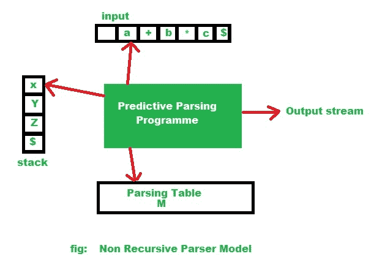
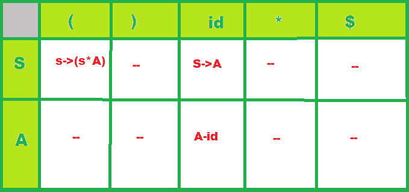

# 非递归预测解析算法

> 原文:[https://www . geesforgeks . org/algorithm-for-non-recursive-predictive-parsing/](https://www.geeksforgeeks.org/algorithm-for-non-recursive-predictive-parsing/)

先决条件–[自上而下解析器的分类](https://www.geeksforgeeks.org/classification-of-top-down-parsers/)
预测[解析](https://www.geeksforgeeks.org/introduction-of-parsing-ambiguity-and-parsers-set-1/)是递归下降解析的一种特殊形式，不需要回溯，因此可以预测使用哪些产品来替换输入字符串。
非递归预测解析或表驱动也称为 LL(1)解析器。这个解析器遵循最左边的推导(LMD)。

```
LL(1):
here, first L is for Left to Right scanning of inputs,
 the second L is for left most derivation procedure,
  1 = Number of Look Ahead Symbols 
```

预测解析过程中的主要问题是确定要应用于非终端的产品。
这个非递归解析器在解析表中查找要应用的产品。LL(1)解析器具有以下组件:

```
(1) buffer: an input buffer which contains the string to be passed 
(2) stack: a pushdown stack which contains a sequence of grammar symbols 
(3) A parsing table: a 2d array M[A, a] 
    where
    A->non-terminal, a->terminal or $
(4) output stream:
 end of the stack and an end of the input symbols are both denoted with $ 
```

**非递归预测解析的算法:**
主概念- >借助 [FIRST()和 FOLLOW()集合](https://www.geeksforgeeks.org/why-first-and-follow-in-compiler-design/)，只需使用避免递归调用的堆栈即可完成该解析。

对于每个规则，语法 G 中的 A-> x:

1.  对于包含在 [FIRST(A)](https://www.geeksforgeeks.org/first-set-in-syntax-analysis/) 中的每个终端‘A’，如果 x 派生‘A’作为第一个符号，则在解析表中添加 A- > x 到 M[A，a]。

2.  如果 FIRST(A)在 [FOLLOW(A)](https://www.geeksforgeeks.org/follow-set-in-syntax-analysis/) 中包含每个终端‘b’的空生产，则将该生产(A- >空)添加到解析表中的 M[A，b]中。

**程序:**

1.  开始时，下推栈保存语法 g 的开始符号

2.  在每一步，从堆栈中弹出一个符号 X:
    如果 X 是一个终端，那么它与前瞻匹配，并且前瞻前进一步，
    如果 X 是非终端符号，那么使用前瞻和解析表(实现第一组)选择一个产品，并且它的右侧被推入堆栈。

3.  这个过程一直重复，直到堆栈和输入字符串变成 null(空)。

**表驱动解析算法:**

**输入:**一个字符串 w 和一个用于 G.
的解析表 M

```
tos top of the stack
Stack[tos++] <-$
Stack[tos++] <-Start Symbol
token <-next_token()
X <-Stack[tos]
 repeat
    if X is a terminal or $ then
       if X = token then
         pop X
          token is next of token() 
           else error()
    else /* X is a non-terminal */
      if M[x, token] = X -> y1y2...yk then
           pop x
          push

         else error()

 X Stack[tos]

until X = $ 
```

//非递归解析器模型图:



所以根据给定的图表非递归解析算法。

**输入:**语法 G 的输入字符串“w”和解析表(“M”)
**输出:**如果 w 在 L(G)中，则为 w 的 LMD；否则为错误指示。

```
Set input pointer to point to the first symbol of the string $;
repeat
let X be the symbol pointed by the stack pointer,
and a is the symbol pointed to by input pointer;
 if X is a terminal or $ then
    if X=a then
       pop X from the stack and increment the input pointer;
    else error()
    end if
  else /*if X is a non terminal */
    if  then

       begin

        pop X from the stack;

        push  onto the stack, with Y1 on top;

        output the production

      end

    else error()

    end if

 end if

until X=$ /* stack is empty */ 
```

**例:**考虑后续 LL(1)语法:

```
S -> A 
S -> ( S * A) 
A  -> id 
```

现在让我们解析给定的输入:

```
( id * id ) 
```

解析表:

*   row->对于每个非终端符号，
*   列->用于每个终端(包括特殊终端)。

该表的每个单元格最多包含给定语法的一个规则:



现在让我们看看使用算法，解析器如何使用这个解析表来处理给定的输入。

**程序:**


解析器因此结束，因为只剩下“{content}”在其堆栈和输入流上。在这种情况下，解析器报告它已经接受了输入字符串，并将以下规则列表写入输出流:

```
S -> ( S * A), 
S -> A, 
A -> id, 
A -> id 
```

这确实是输入字符串的 LMD 规则列表，即:

```
S -> ( S * A ) -> ( A * A ) -> ( id * A ) -> ( id * id )  
```