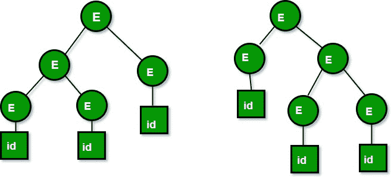

# 歧义语法

> 原文:[https://www.geeksforgeeks.org/ambiguous-grammar/](https://www.geeksforgeeks.org/ambiguous-grammar/)

你也可以阅读我们之前讨论过的关于[上下文无关语法分类的文章。](https://www.geeksforgeeks.org/classification-of-context-free-grammars/)

T1】C 上下文 **F** ree **G** 夯锤(CFG)的分类基于:

*   派生树的数量
*   字符串数

根据衍生树的数量，CFG 被细分为两种类型:

*   模糊语法
*   明确的语法

**歧义语法:**

如果给定输入字符串存在多个派生树，即存在多个**L**eft**M**ost**D**验证 **T** ree (LMDT)或**R**ight**M**ost**D**验证 **T** ree，则认为 CFG 是歧义的

**定义:** G = (V，T，P，S)是一个 CFG 据说是模棱两可的当且仅当 T*中存在一个有多个解析树的字符串。
其中 V 是一组有限的变量。
T 是一组有限的端子。
P 是 A - > α形式的有限乘积集，其中 A 是变量，α∞(V∪T)* S 是称为起始符号的指定变量。

**举例:**

1。让我们考虑一下这个语法: **E - > E+E|id**

我们可以根据这个语法创建 2 个解析树，得到一个字符串 **id+id+id** :

以下是通过最左侧派生生成的两个解析树:

[](https://media.geeksforgeeks.org/wp-content/uploads/grammertree.jpg)

以上两个解析树都源自相同的语法规则，但是两个解析树是不同的。因此语法是模糊的。

2。现在让我们考虑以下语法:

```
Set of alphabets ∑ = {0,…,9, +, *, (, )}

E -> I        
E -> E + E
E -> E * E
E -> (E)
I -> ε | 0 | 1 | … | 9

```

从上面的语法字符串 **3*2+5** 可以通过两种方式导出:

```
I) First leftmost derivation                   II) Second leftmost derivation
        E=>E*E                          E=>E+E
         =>I*E                           =>E*E+E
         =>3*E+E                                       =>I*E+E
         =>3*I+E                           =>3*E+E
         =>3*2+E                           =>3*I+E
         =>3*2+I                           =>3*2+I
         =>3*2+5                           =>3*2+5

```

以下是一些歧义语法的例子:

*   s-> as | sa |є
*   E-> E +E | E*E| id
*   A -> AA | (A) | a
*   S -> SS|AB，A -> Aa|a，B -> Bb|b

鉴于以下语法是明确的:

*   S -> (L) | a，L-> | LS | S
*   S -> AA，A -> aA，A -> b

**本来就模棱两可的语言:**

让 L 成为无语境语言(CFL)。如果每一个语言 L = L(G)的上下文无关语法 G 都是模棱两可的，那么 L 就被认为是天生模棱两可的语言。歧义是语法而不是语言的特性。模棱两可的语法不太可能对编程语言有用，因为同一字符串(程序)的两个解析树结构(或更多)意味着程序的两个不同含义(可执行程序)。

一种本质上模棱两可的语言绝对不适合作为一种编程语言，因为我们没有办法为它的所有程序固定一种独特的结构。

例如，

```
L = {anbncm} ∪ {anbmcm} 
```

**注:**语法歧义是不可判定的，即没有消除语法歧义的特定算法，但我们可以通过:

**消除语法歧义**即重写语法，使得语法所代表的语言的一个字符串只有一个可能的派生或解析树。

本文由**赛基兰·古德·伯拉**整理。

发现任何不正确的地方，请写评论，或者想分享更多关于以上讨论话题的信息