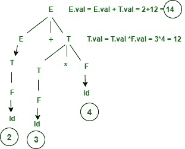

# 句法指导翻译的应用

> 原文:[https://www . geesforgeks . org/语法指导翻译应用/](https://www.geeksforgeeks.org/application-of-syntax-directed-translation/)

在本文中，我们将介绍语法指导翻译的应用，我们还将看到真实的例子，以及如何使用这些应用程序解决问题。让我们一个一个来讨论。

先决条件:[句法指导翻译简介](https://www.geeksforgeeks.org/syntax-directed-translation-in-compiler-design/)

**句法定向翻译:**
用于语义分析，SDT 基本用于构造语法语义动作的解析树。在语法中，需要决定谁的优先级最高将首先完成，而在语义动作中，将决定什么类型的动作由语法完成。

**示例:**

```
SDT = Grammar+Semantic Action
Grammar = E -> E1+E2  
Semantic action= if (E1.type != E2.type) then print "type mismatching"
```

**句法指导翻译的应用:**

*   SDT 用于执行算术表达式。
*   从中缀到后缀表达式的转换。
*   中缀到前缀表达式的转换。
*   它也用于二进制到十进制的转换。
*   在计算还原数时。
*   在创建语法树时。
*   SDT 用于生成中间代码。
*   将信息存入符号表。
*   SDT 也常用于类型检查。

**示例:**
在这里，我们将介绍一个应用 SDT 的示例，以便更好地理解 SDT 应用程序的用途。让我们考虑一个算术表达式的例子，然后您将看到如何构建 SDT。

让我们考虑算术表达式给出。

```
Input : 2+3*4
output: 14
```

以上示例的 SDT。



2+3*4 的特殊目的测试

**语义动作给出如下。**

```
E -> E+T  { E.val = E.val + T.val then print (E.val)}
     |T   { E.val = T.val} 
T -> T*F  { T.val = T.val * F.val}
     |F   { T.val = F.val}
F -> Id   {F.val = id}
```