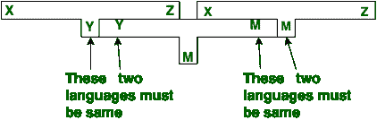
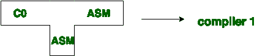
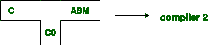
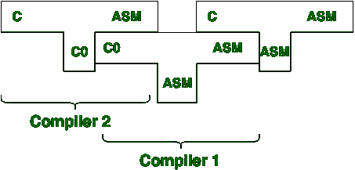

# 编译器设计中的引导

> 原文:[https://www . geesforgeks . org/bootstrapping-in-compiler-design/](https://www.geeksforgeeks.org/bootstrapping-in-compiler-design/)

**引导**是一个过程，其中简单的语言被用来翻译更复杂的程序，反过来可以处理更复杂的程序。这个复杂的程序可以进一步处理更复杂的程序等等。

为任何高级语言编写编译器都是一个复杂的过程。从头开始编写编译器需要很多时间。因此，在某些阶段使用简单的语言来生成目标代码。要清楚地理解**自举**技术，请考虑以下场景。

假设我们想为新语言 x 编写一个交叉编译器，这个编译器的实现语言是 say Y，正在生成的目标代码是语言 z，也就是说，我们创建了 XYZ。现在，如果现有的编译器 Y 运行在机器 M 上，并为 M 生成代码，那么它被表示为 YMM。现在，如果我们使用 YMM 运行 XYZ，那么我们得到一个编译器 XMZ。这意味着源语言 X 的编译器会生成语言 Z 的目标代码，并在机器 m 上运行。

下图说明了上述场景。

**示例:**
我们可以创建许多不同形式的编译器。现在我们将生成。

一种编译器，它采用 C 语言，并在有汇编语言机器的情况下生成汇编语言作为输出。

*   **Step-1:** First we write a compiler for a small of C in assembly language.

    

*   **Step-2:** Then using with small subset of C i.e. C0, for the source language c the compiler is written.

    

*   **Step-3:** Finally we compile the second compiler. using compiler 1 the compiler 2 is compiled.

    

*   **步骤-4:** 这样我们得到了一个用 ASM 编写的编译器，它编译 C 语言并在 ASM 中生成代码。