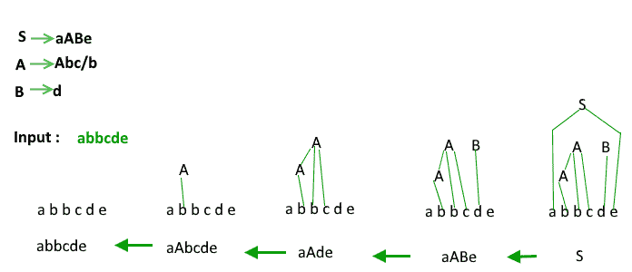
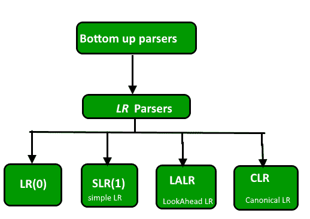
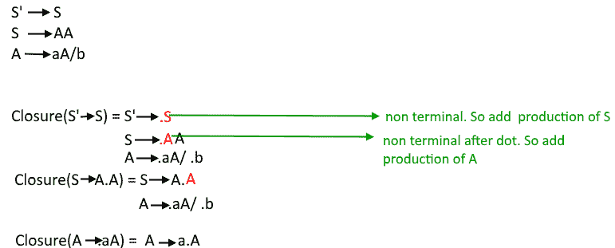
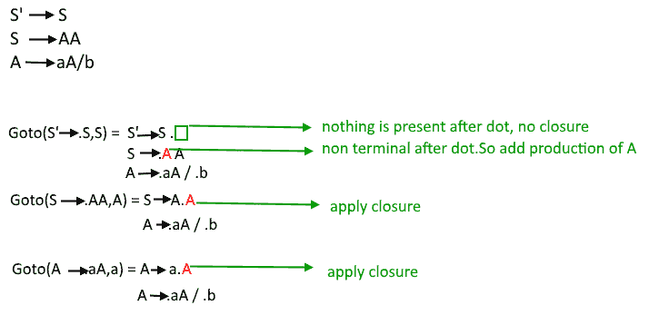
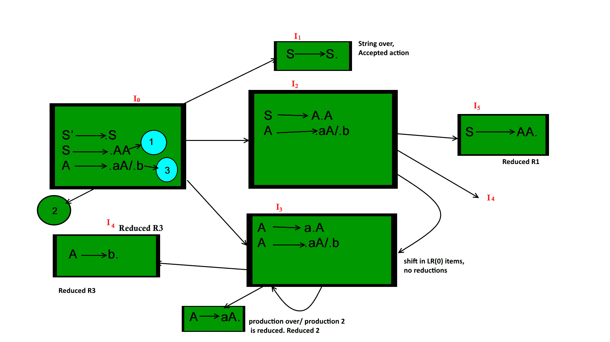
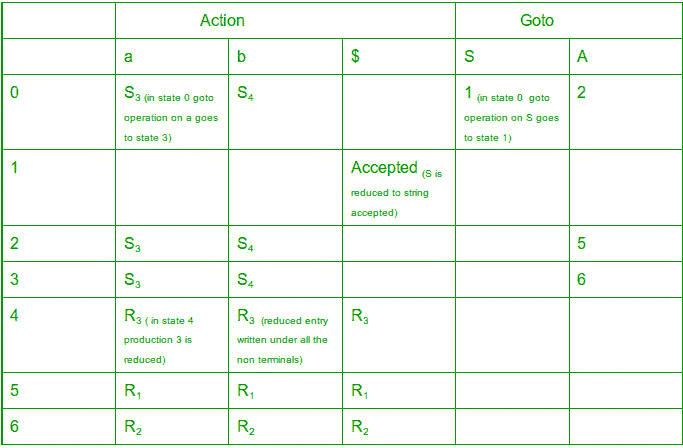

# 自下而上或移位缩减解析器|第 2 集

> 原文:[https://www . geesforgeks . org/自下而上-或-shift-reduce-parser-set-2/](https://www.geeksforgeeks.org/bottom-up-or-shift-reduce-parsers-set-2/)

在本文中，我们将讨论自底向上解析器。
**【自下而上解析器/移位缩减解析器】**
构建从叶子到根的解析树。自下而上的解析可以被定义为试图通过反向追踪 w 的最右派生词，将输入字符串 w 简化为语法的起始符号。
例

**自下而上解析器的分类**

一般的移位约简解析是 LR 解析。L 代表从左到右扫描输入，R 代表反向构造最右边的导数。
LR 解析的优势:

1.  许多编程语言使用 LR 解析器的一些变体。需要注意的是，C++和 Perl 都是它的例外。
2.  LR 解析器可以非常有效地实现。
3.  在所有从左到右扫描符号的解析器中，LR 解析器会尽快检测到语法错误。

这里我们将通过使用所有四种 LR 解析技术来研究 GOTO 语法图的构造。为了解决 GATE 中的问题，我们必须为给定的语法直接构造 GOTO 以节省时间。

**LR(0)解析器**
我们需要两个函数–
闭包()
Goto()

**增广语法**
如果 G 是一个带有起始符号 S 的语法，那么 G’的增广语法就是一个带有新的起始符号 S’和一个生产符号 S’->S 的语法。这个新的起始生产的目的是向解析器指示它何时应该停止解析并宣布接受输入。
让一个语法为 S - > AA
A - > aA | b
上述语法的扩充语法为
S '->S
S->AA
A->AA | b

**LR(0)项**
LR(0)是语法 G 的项，是 G 的产物，在右侧某个位置有一个点。
S - > ABC 生产四种产品
S - >。ABC
S->A . BC
S->AB。C
S - > ABC。
生产 A - > ε只生成一个物料 A - >。

**闭包运算** :
如果 I 是一个语法 G 的一组项，那么闭包(I)就是由 I 通过两个规则构造的一组项:

1.  最初，I 中的每一项都被添加到闭包 I 中。
2.  如果 A -> α.Bβ在闭包(I)中，而 B -> γ是一个产品，那么将项目 B->γ添加到 I 中，如果它还不存在的话。我们应用这个规则，直到没有更多的项目可以添加到闭包(I)。

例:

**转到操作** :
转到(I，X) = 1。通过在 x 后面移动点来添加 I。
2。在第一步应用闭包。

**GOTO 图的构建-**

*   状态一0–扩大左后(0)项目关闭
*   使用 I 0 在 DFA 的帮助下找到 LR(0)项集合的所有集合
*   将 DFA 转换为 LR(0)解析表

**LR(0)解析表**的构建:

*   action 函数将状态 I 和终端 a(或输入结束标记$)作为参数。ACTION[i，a]的值可以有四种形式之一:
    1.  移位 j，其中 j 是一个状态。
    2.  减少 A -> β。
    3.  接受
    4.  错误
*   我们将在项目集上定义的 GOTO 函数扩展到状态:如果 GOTO[I i ，A] = I j ，那么 GOTO 也将状态 I 和非终端 A 映射到状态 j

例:
考虑语法 S - > AA
A - > aA | b
扩充语法 S '->S
S->AA
A->AA | b

上述 GOTO 图的 LR(0)解析表为–

表的 Action 部分包含语法的所有终结符，而 goto 部分包含所有非终结符。对于 goto 图的每个状态，我们在表中写下所有的 goto 操作。如果 goto 被应用到一个终端，而不是它被写入动作部分，如果 goto 被应用到一个非终端，它被写入 goto 部分。如果在应用 goto 时，生产减少(即，如果点到达生产的终点，并且不能应用进一步的闭合)，则将其表示为 R i ，如果生产没有减少(移动)，则将其表示为 S i 。
如果一个生产被减少，它被写在生产左侧跟随给出的终端下，例如:在 I 5 S- > AA 被减少，所以 R 1 被写在 LR(0)解析器中跟随(S)={$}(要了解更多关于如何计算跟随函数的信息:[点击这里](https://www.geeksforgeeks.org/compiler-design-follow-set-in-syntax-analysis/))。
如果在一种状态下，语法的起始符号被减少，它被写在$ symbol 下作为接受。

**注意:**如果在任何状态下，缩减的和移位的产物都存在，或者两个缩减的产物都存在，这被称为冲突情况，并且语法不是 LR 语法。

**注:**
1。一个州的两个减少的作品–RR 冲突。
2。一个州减产，一个州减产——服务请求冲突。

如果解析表中不存在 SR 或 RR 冲突，则语法为 LR(0)语法。
在以上语法中没有冲突所以是 LR(0)语法。

**注—** 在求解 GATE 问题时我们不需要制作解析表，只看 GOTO 图就可以判断语法是否为 LR(0)语法。我们只需要在 goto 图中寻找冲突，也就是说，如果一个状态包含一个 TERMINAL 变量的两个 reduce 或一个 reduce 和一个 shift 条目，那么就有冲突，并且它不是 LR(0)语法。(在一个移位有一个变量和一个减少的情况下，不会有冲突，因为移位条目将进入表的 go to 部分，减少的条目将进入 ACTION 部分，因此没有多个条目)。

本文由**帕鲁尔·夏尔马**供稿。