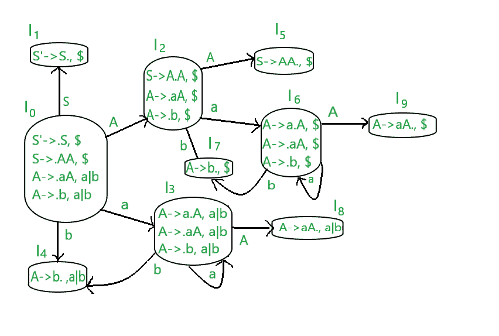
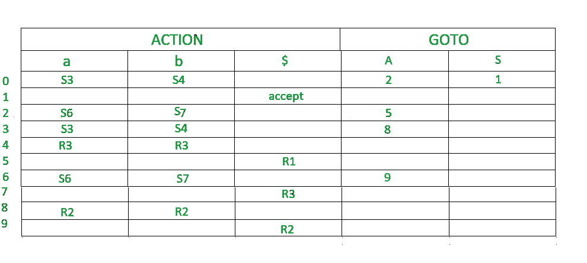

# CLR 解析器(带示例)

> 原文:[https://www.geeksforgeeks.org/clr-parser-with-examples/](https://www.geeksforgeeks.org/clr-parser-with-examples/)

**LR 解析器:**
这是一种高效的自下而上的语法分析技术，可以用来解析大类的上下文无关语法，称为 LR(k)解析。
L 代表从左到右扫描
R 代表在 reverese 中最右边的派生
0 代表前瞻
的输入符号数量更多参考，敬请访问[https://www.geeksforgeeks.org/lr-parser/](https://www.geeksforgeeks.org/lr-parser/)

**LR 解析的优势:**

*   它识别了几乎所有可以编写 CFG 的编程语言结构
*   它能够检测语法错误
*   这是一种高效的非回溯移位约简解析方法。

**LR 解析方法类型:**

1.  自动装弹步枪
2.  清除（clear 的缩写）
3.  拉勒

**CLR 解析器:**
CLR 解析器代表规范 LR 解析器。它是一个更强大的 LR 解析器。它利用了前瞻符号。这种方法使用一大组称为 LR(1)项的项。LR(0)项和 LR(1)项的主要区别在于，在 LR(1)项中，有可能在一个状态中携带更多的信息，这将排除无用的约简状态。这个额外的信息通过前瞻符号被合并到状态中。一般语法变成【A->∧。b、a ]
其中 A->∧。b 是生产，a 是终端或右端标记$
LR(1)项=LR(0)项+向前看

**如何在制作中加入前瞻？**
**案例 1–**

```
A->∝.BC, a 
```

假设这是第 0 次生产。现在，自从“.”先于 B，所以我们也要写 B 的作品。

```
B->.D [1st production]
```

假设这是 B 的作品。这部作品的前景是在我们看以前的作品即第 0 部作品时给出的。无论 B 之后是什么，我们都会找到 FIRST(该值)，这是 FIRST 生产的前瞻。所以，在第 0 次生产中，在 B 之后，C 在那里。假设第一个(C)=d，那么第一个生产成为

```
B->.D, d
```

**案例 2–**
如果第 0 部作品是这样的，

```
A->∝.B, a 
```

在这里，我们可以看到 b 之后什么都没有，所以第 0 次生产的前瞻将是第 1 次生产的前瞻。ie-

```
B->.D, a
```

**案例 3–**
假设生产 A- > a|b

```
A->a,$ [0th production]
A->b,$ [1st production]
```

这里，第一个产品是前一个产品的一部分，因此前瞻将与其前一个产品相同。
这是向前看的 2 个法则。

**构建 CLR 解析表的步骤:**

1.  写作扩充语法
2.  LR(1)待发现项目的集合
3.  在 CLR 解析表中定义 2 个函数:转到[终端列表]和动作[非终端列表]

**示例**
**为给定的上下文无关语法**构建一个 CLR 解析表

```
S-->AA    
A-->aA|b
```

**解决方案:**
**步骤 1–**查找扩充语法

给定语法的扩充语法是:-

```
S'-->.S ,$   [0th production]    
S-->.AA ,$ [1st production]    
A-->.aA ,a|b [2nd production]      
A-->.b ,a|b [3rd production]
```

让我们将前瞻规则应用于上述产品

*   最初的预期总是 100 美元
*   现在，第一部作品因为“.”而诞生在第 0 次生产“S”之前。“S”之后没有任何内容，因此第 0 个生产的前瞻将是第 1 个生产的前瞻。ie:S–>。AA，$
*   现在，第二部作品因“.”而产生在第一部作品的 A 之前。在“A”之后，有“A”。所以，FIRST(A)是 A，b
    所以，第二部作品的前瞻变成了 a|b
*   现在，第三个产品是第二个产品的一部分。所以，未来的前景将是一样的。

**步骤 2–**查找 LR(0)物品集合
下图为 LR(0)物品集合。我们会一件一件了解一切。



这个语法的终端是{a，b}
这个语法的非终端是{S，A}

**规则-**

1.  如果任何非终端有“.”在它之前，我们必须写下它所有的作品并加上“.”在每次生产之前。
2.  从一个状态到下一个状态的“.”向右移动一个位置。
3.  前瞻的所有规则都适用于此。

*   在图中，I0 由扩充语法组成。
*   木卫一什么时候去 I1 第 0 次生产的产品被转移到 S(S'->S)的右侧。这个状态就是接受状态。编译器会看到 s。因为 I1 是第 0 部作品的一部分，所以前瞻是一样的
*   当“.”时，Io 转到 I2 第一部作品的重心向右移。编译器会看到。因为 I2 是第一个产品的一部分，所以前瞻是相同的，即$。
*   当“.”时，I0 转到 I3 第二部作品的主题向右移了。编译器会看到。因为 I3 是第二部作品的一部分，所以前瞻是相同的。
*   当“.”时，I0 转到 I4 第三部作品的重心向右移(A->b)。编译器会看到 b。由于 I4 是第三代产品的一部分，所以前瞻是相同的，即 a | b。
*   当“.”时，I2 转到 I5 第一次生产的位置向右移动(S->AA。) .编译器会看到。由于 I5 是第一个产品的一部分，所以前瞻是相同的，即$。
*   当“.”时，I2 转到 I6 第二部的作品被移向右边。编译器会看到。由于 I6 是第二个产品的一部分，所以前瞻是相同的，即$。
*   当“.”时，I2 转到 I7 第三次生产的位置向右移动(A->b)。编译器会看到。由于 I6 是第三代产品的一部分，所以前瞻是相同的，即$。
*   当“.”时，I3 转到 I3 第二部作品的主题向右移了。编译器会看到。由于 I3 是第二部作品的一部分，所以前瞻是相同的，即 a|b。
*   当“.”时，I3 转到 I8 生产的第二部分向右移动(A->aA。) .编译器会看到。由于 I8 是第二个产品的一部分，所以前瞻是相同的，即 a|b。
*   当“.”时，I6 转到 I9 生产的第二部分向右移动(A->aA。) .编译器会看到。由于 I9 是第二个产品的一部分，所以前瞻是相同的，即$。
*   当“.”时，I6 转到 I6 第二部作品的主题向右移了。编译器会看到。由于 I6 是第二个产品的一部分，所以前瞻是相同的，即$。
*   当“.”时，I6 转到 I7 第三部作品的重心向右移(A->b)。编译器会看到 b。由于 I6 是第三代产品的一部分，所以前瞻是相同的 ie $。

**STEP 3-** 定义 2 个功能:转到解析表中的【终端列表】和动作【非终端列表】。下面是 CLR 解析表



*   默认情况下，$是非终端，处于接受状态。
*   0，1，2，3，4，5，6，7，8，9 表示 I0，I1，I2，I3，I4，I5，I6，I7，I8，I9
*   I0 在 I2 中给出 A，所以 2 加到 A 列和 0 行。
*   I0 在 I1 给出 S，所以在 S 列和第一行加 1。
*   类似地，5 写在 A 列和第 2 行，8 写在 A 列和第 3 行，9 写在 A 列和第 6 行。
*   I0 在 I3 中给出一个，所以 S3(移位 3)被加到一列 0 行。
*   I0 在 I4 中给出 b，因此 S4(移位 4)被添加到 b 列和 0 行。
*   类似地，S6(移位 6)被添加到“a”列和 2，6 行，S7(移位 7)被添加到 b 列和 2，6 行，S3(移位 3)被添加到“a”列和 3 行，S4(移位 4)被添加到 b 列和 3 行。
*   I4 被简化为“.”就在尽头。I4 是语法的第三个产物。因此，在前瞻列中写入 r3(reduce 3)。I4 的前视是 a 和 b，所以在 a 和 b 列写 R3。
*   I5 简化为“.”就在尽头。I5 是语法的第一个产物。因此，在前瞻列中写入 r1(reduce 1)。I5 的前瞻价格是 10 美元，所以在$一栏写下 R1。
*   同样，在 a、b 栏和第 8 行写 R2，在$栏和第 9 行写 R2。