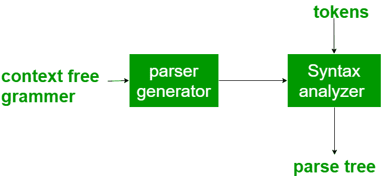
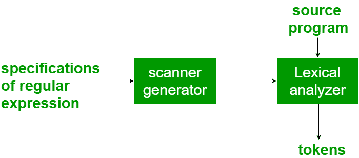

# 编译器构造工具

> 原文:[https://www.geeksforgeeks.org/compiler-construction-tools/](https://www.geeksforgeeks.org/compiler-construction-tools/)

编译器作者可以使用一些专门的工具来帮助实现编译器的各个阶段。这些工具有助于创建整个编译器或其部分。一些常用的编译器构建工具包括:

1.  **Parser Generator –**
    It produces syntax analyzers (parsers) from the input that is based on a grammatical description of programming language or on a context-free grammar. It is useful as the syntax analysis phase is highly complex and consumes more manual and compilation time.
    Example: PIC, EQM

    

2.  **Scanner Generator–**
    它根据输入生成词法分析器，该分析器由基于语言标记的正则表达式描述组成。它生成一个有限自动机来识别正则表达式。
    示例:莱克斯

6.  **语法指导翻译引擎–**
    它从由解析树组成的输入中生成具有三种地址格式的中间代码。这些引擎有遍历解析树的例程，然后生成中间代码。在这种情况下，解析树的每个节点都与一个或多个翻译相关联。
7.  **自动代码生成器–**
    它为目标机器生成机器语言。中间语言的每个操作都使用一组规则进行翻译，然后由代码生成器作为输入。使用模板匹配过程。使用模板，中间语言语句被其等价的机器语言语句替换。
8.  **数据流分析引擎–**
    用于代码优化。数据流分析是收集信息的代码优化的关键部分，这些信息是从程序的一部分流向另一部分的值。参见–[编译器](https://www.geeksforgeeks.org/data-flow-analysis-compiler/)中的数据流分析
9.  **编译器构建工具包–**
    它提供了一套集成的例程，有助于构建编译器组件或构建编译器的各个阶段。