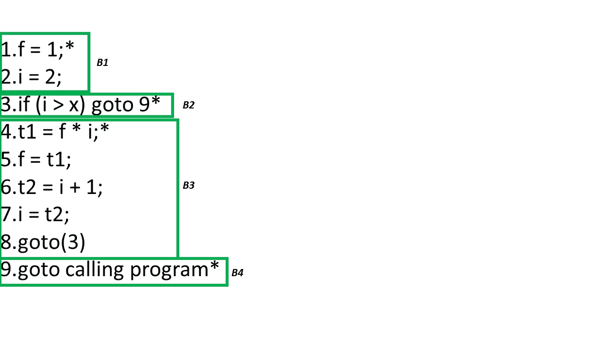
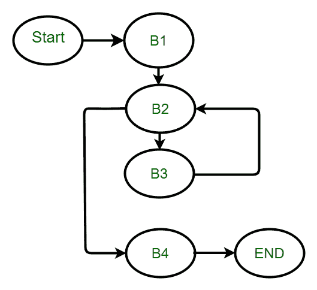

# 编译器设计|检测三地址码中的循环

> 原文:[https://www . geesforgeks . org/编译器-设计-检测三地址码中的循环/](https://www.geeksforgeeks.org/compiler-design-detection-of-a-loop-in-three-address-code/)

先决条件–[编译器中的三个地址码](https://www.geeksforgeeks.org/three-address-code-compiler/)
循环优化是中间代码生成之后的阶段。这个阶段的主要目的是减少程序中的行数。在任何程序中，任何程序花费的大部分时间实际上都在迭代程序的循环中。在递归程序的情况下，块会在那里，并且大部分时间会出现在块内。

**循环优化–**

1.  为了应用循环优化，我们必须首先检测循环。
2.  为了检测循环，我们使用控制流分析，使用程序流图(PFG)。
3.  要找到程序流程图，我们需要找到基本块

**基本块–**基本块是由三个地址语句组成的序列，其中控制从开头进入，只在结尾离开，没有任何跳转或停顿。

**寻找基本块–**
为了找到基本块，我们需要找到程序中的领导者。那么基本块将从一个领导者开始到下一个领导者，但不包括下一个领导者。这意味着如果你发现 1 号线是一条引线，15 号线是下一条引线，那么 1 到 14 号线就是一个基本块，但不包括 15 号线。

**识别基本块中的领导者–**

1.  第一句话永远是领导者
2.  条件语句或非条件语句的目标语句是前导语句
3.  紧接在条件或非条件语句之后的语句是前导语句

```
fact(x)
{
    int f = 1;
    for (i = 2; i <= x; i++)
        f = f * i;
    return f;
}
```

**上述 C 码的三个地址码**:

1.  f = 1；
2.  I = 2；
3.  如果(i > x)转到 9
4.  t1 = f * I；
5.  f = t1
6.  T2 = I+1；
7.  i = t2
8.  转到(3)
9.  转到调用程序

**领导者和基本块–**



**控制流分析–**



如果控件进入 B1，则在 B1 之后没有其他选项，它必须进入 B2。现在，如果控制进入 B2，那么根据条件控制将流动，如果条件为真，我们将进入第 9 行，这意味着 9 只不过是 B4。但是如果条件是假的，控制转到下一个街区 B3。B3 之后，根本没有条件我们直接去第三个声明 B2。上面的控制流程图在 B2 和 B3 之间有一个循环，这只是一个循环。