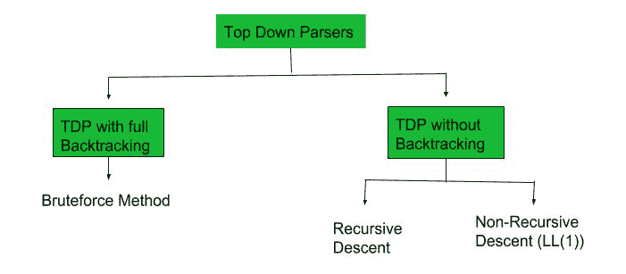

# LL(1)解析表

的构建

> 原文:[https://www . geesforgeks . org/construction-of-ll1-parsing-table/](https://www.geeksforgeeks.org/construction-of-ll1-parsing-table/)

先决条件–[自顶向下解析器的分类、](https://www.geeksforgeeks.org/compiler-design-classification-top-parsers/) [第一个集合](https://www.geeksforgeeks.org/compiler-design-first-in-syntax-analysis/)、[跟随集合](https://www.geeksforgeeks.org/compiler-design-follow-set-in-syntax-analysis/)
自顶向下的解析器从开始的非终端开始构建解析树。有两种类型的自顶向下解析器:

1.  具有回溯功能的自顶向下解析器
2.  无回溯的自顶向下解析器

没有回溯的自顶向下解析器可以进一步分为两部分:



在本文中，我们将讨论非递归下降，也称为 LL(1)解析器。

**LL(1)解析:**
这里第一个 **L** 表示输入的扫描将从左到右进行，第二个 **L** 表示在这个解析技术中我们将使用最左边的派生树。最后 **1** 代表前瞻的次数，也就是你想做决定的时候会看到多少个符号。

**构造 LL(1)解析表的算法:**

**第一步:**首先检查语法中的[左递归](https://www.geeksforgeeks.org/removing-direct-and-indirect-left-recursion-in-a-grammar/)，如果语法中有左递归，去掉它，进入第二步。

**第 2 步:**计算所有非终端的 First()和 Follow()。

1.  **[**First**](https://www.geeksforgeeks.org/first-set-in-syntax-analysis/)**():**如果有一个变量，并且从这个变量开始，如果我们试图驱动所有的字符串，那么开始的 Terminal Symbol 被称为 First。**
2.  **[跟随](https://www.geeksforgeeks.org/follow-set-in-syntax-analysis/)():推导过程中跟随一个变量的终端符号是什么。**

****步骤 3:** 对于每个产品 A–>α。(A 趋于α)**

1.  **找到第一个(α)，对于第一个(α)中的每个终端，在表格中输入 A –>α。**
2.  **如果第一个(α)包含ε(ε)作为终端，找到跟随(A)，对于跟随(A)中的每个终端，在表中输入 A–>α。**
3.  **如果第一个(α)包含ε，随后的(A)包含$作为终端，则在表中为$输入 A –>α。
    为了构建解析表，我们有两个函数:** 

**在表中，行将包含非终端，列将包含终端符号。语法的所有**空产物**将位于跟随元素下，其余产物将位于第一个集合的元素下。**

**现在，让我们用一个例子来理解。**

****示例-1:**
考虑语法:** 

```
E --> TE'
E' --> +TE' | ε                
T --> FT'
T' --> *FT' | ε
F --> id | (E)

*ε denotes epsilon
```

**找到他们的第一套和第二套:**

<figure class="table">

|   | 第一 | 跟随 |
| --- | --- | --- |
| 【t0e】->te‘ | { id，(} | { $, ) } |
| **是─>+te '/**ε | { +， e } | { $, ) } |
| **T–>FT '** | { id，(} | { +, $, ) } |
| **——>* ft '/**ε | { *， e } | { +, $, ) } |
| **F–>id/(E)** | { id，(} | { *, +, $, ) } |

**现在，LL(1)解析表是:**

<figure class="table">

|   | 身份证明（identification） | + | * | （ | ) | $ |
| --- | --- | --- | --- | --- | --- | --- |
| **E** | e–>茶 |   |   | e–>茶 |   |   |
| **E'** |   | 这是-->+茶 |   |   | 是->ε | 是->ε |
| **T** | ' t–> FT ' |   |   | ' t–> FT ' |   |   |
| **T'** |   | t->ε | ' t '–> * FT ' |   | t->ε | t->ε |
| **F** | f–> id |   |   | f–>(英) |   |   |

**正如您所看到的，所有的空产品都放在该符号的跟随集之下，所有剩余的产品都位于该符号的第一个之下。**

****注意:**每种语法对于 LL(1)解析表都不可行。一个细胞可能含有一种以上的产物。**

**我们来看一个例子。**

****示例-2:**
考虑语法** 

```
S --> A | a
A --> a 
```

**找到他们的第一套和第二套:**

<figure class="table">

|   | 第一 | 跟随 |
| --- | --- | --- |
| **S–>A/A** | { a } | { $ } |
| **A–>A** | { a } | { $ } |

**解析表:**

<figure class="table">

|   | a | $ |
| --- | --- | --- |
| **S** | S–> A，S–> A |   |
| **A** | a–> a |   |

**在这里，我们可以看到同一个细胞中有两种产物。因此，这种语法对于 LL(1)解析器是不可行的。** 

</figure>

</figure>

</figure>

</figure>