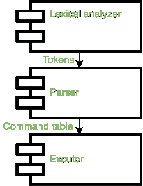
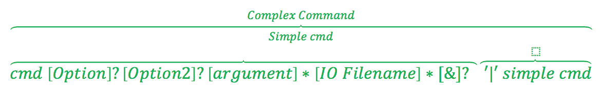
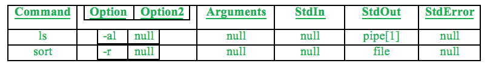

# 开发基于 Linux 的外壳

> 原文:[https://www.geeksforgeeks.org/developing-linux-based-shell/](https://www.geeksforgeeks.org/developing-linux-based-shell/)

**什么是贝壳？**

它是用户交互的操作系统的可见部分，用户通过向外壳提供命令来与操作系统交互，外壳反过来解释这些命令并执行它们。

下图显示了简化的执行过程，其中 shell 接收输入，
将其传递给词法分析器(将详细讨论)，词法分析器将创建标记，然后词法分析器的输出将被传递给解析器，解析器检查其语法错误并执行分配的语义动作(这将构建命令表)，最后当解析器到达某个点时，该表将被执行。

外壳将由 3 个组件实现，如下图所示:



**1。词法分析器**
输入解析的第一部分是词法分析阶段，在这个阶段，输入被逐个字符地读取以形成标记，我们将使用一个名为 lex 的命令来构建我们的文件，在这个文件中，我们将定义我们的模式，后跟:标记名词法分析器将逐个字符地读取输入，当模式与左边的字符串匹配时，它将被转换为右边的字符串。
ex:

```
Command input: ls -al

```

解析器将读取 l，然后 s 形成一个名为 WORD 的标记，然后它将读取–和字符(al)并形成一个 OPTION，输出将是 WORD OPTION，该输出将被传递给解析器以检查是否有语法错误。

> 1." #:我〔t0〕2 .[ 1 ]？">:我
> 3。" :我〔T2〕5。[ 1]？"> >:我
> 6。【1-2】>&【1-2】:较高
> 7。" | ":管道
> 8 ."&:修剪
> 9。[ ]备选案文:[a-za-z0-9]*
> 10。[ ]备选案文 2
> 11。\ % \ = \+' \(\)\ $/\ _ \-\-\ % \+'。\？\*\~a-zA-Z0-9]+ : WORD

上面的语法由 11 个标记组成，当输入符合标记描述时，这些标记就形成了。
IO 标记由#字符或“>”组成，前面可以是数字 1(最多一次)，或者“我们引入它作为一个新标记来代替错误重定向标记，另一种 IO 形式是使用“> >”，前面可以是数字 1(最多一次)，最后是“> &”，这是一个 IOR，前面和/或后面可以是一个或两个。

管道符号和&符号分别在“|”和“&”处形成，选项符号在连字符前面加空格，后面加任何字母或数字时形成。
option 2 标记由两个连字符组成，前面是空格，后面是任何字母字符。
单词标记可以由字母字符、数字和下列字符构成%、=、+、'、"、(、)、$、/、_、-、。, ?, *, ~

**2。解析器**
从输入中形成标记后，标记作为流传递给解析器，解析器解析输入以检测语法错误并执行指定的语义动作。解析器可以被认为是语言的语法和句法(它定义了我们的命令看起来像什么是可以接受的)，我们将使用一个名为 yacc 的命令来编译语法，我们将把语法构造成一种状态形式，这使得语法的构造和部署更加容易。

下面是我们的语法定义:

> 1.q00:newline { return 0；} | cmd q1 q0 |错误；
> 2 .Q0:newline { return 1；} |管道 q00 { clrcnt；}：
> 3 .q1:选项 q2 |选项 Q2 | arg _ list Q3 | io _ modifier Q4 | background q5 | io _ descr Q3 |/* empty */insert node()；clrcnt()；}：
> 4 .第二季:arg _ list Q3 | io _ modifier Q4 | io _ descr Q3 | q5 |/*背景空白*/insert node()；clrcnt()；}：
> 5 .Q3:io _ modifier Q4 | io _ descr Q3 | q5 |/* empty */insert node()；clrcnt()；}：
> 6。Q4:Q3 文件：
> 7。cmd:word { cmad . cmd = yylval . str；}：
> 8。arg _ list:arg | arg _ list；
> 9。arg:word { insertargnode(yylval . str)；}：
> 10。文件:word { io _ red(yylval . str)；}：
> 11。io _ modifier:io { cmad . op = yylval . str；}：
> 12。io_descr:上{ cmad . op=yylval . str}：
> 13。选项:选项{ cmad . opt = yylval . str} |选项 2 { cmad . opt 2 = yylval . str}：
> 14。背景:投影{ bg = ' 1}：
> 15。q5:/*空白*/insert node()；clrcnt()；}：

上面的语法指定了解析过程的不同状态，

解析器从状态 q00 开始并进行解析，直到到达状态 q5、q3、q1 之一，这是以相反的方式发生的，因为使用了解析技术(自下而上解析)，语法根据标记的位置来减少标记，Word 如果出现在开头，则可以减少为 cmd，如果出现在命令之后，则为 arg_list，如果出现在重定向之后，则为 file，然后根据语法来解析句子， 从状态 q00 开始，解析器通过读取 cmd 移动到状态 q1，在状态 q1，如果解析器读取一个选项，句子可以有以下参数之一，IO 或 background after，或者什么都没有，如果解析器读取参数，句子只能有重定向 after，如果解析器读取一个&符号，后面应该什么都没有。

然后，当解析器读取一个管道时，这个过程再次开始，这允许多个简单的命令通过管道连接起来，形成一个复杂的命令。
我们将简单命令定义为由命令、选项、参数和/或 IO 重定向组成的任何命令。
使用管道组合多个简单命令会产生一个我们称之为复杂命令的结构。

与语法相关联的语义动作构建解析表，并将命令值分配给数据结构，数据结构在构建命令表后被发送给执行器。
命令表由简单命令的行组成，这些行由管道连接的复杂命令、保存要执行的命令名称的简单 command 条目、作为要与命令一起执行的选项的 options、保存应该传递给命令的参数的 arguments、指定命令将从其获取输入的位置的 standard-in (stdIn)默认情况下是终端，除非在命令中另有指定， standard-out (stdOut)指定命令打印执行输出的位置，默认情况下是终端，standard-error (stdError)指定命令打印执行错误消息的位置，默认情况下是终端，除非用户重定向。

构建的语法允许以下语法:



它允许带有选项、参数、IO 重定向的命令成为后台进程(&)。一个命令与前面的任何一个都是一个简单的命令当我们连接多个简单的命令时，我们就形成了一个复杂的命令。

在解析命令时，我们的解析器将命令细节保存在表中，以便传递给执行器。

我们选择了一个表作为我们的数据结构，我们需要存储关于每个命令的以下信息，命令、选项、选项 2、参数、标准输入、标准输出、标准错误。

例如:

```
ls –al | sort -r

```

该命令将生成下表(每行是一个简单的命令，表本身是一个复杂的命令)。


**3.执行者**

在构建了命令表之后，执行器负责为表中的每个命令创建一个进程，并在需要时处理任何重定向。
执行器遍历表，执行每个简单的命令，并在表中的每个条目处将其连接到下一个命令(简单命令)执行器命令将命令、选项和参数传递给 execvp 函数，该函数用被调用的命令替换当前调用过程，execvp 函数作为第一个参数接收要执行的文件的名称和包含选项(如果有的话)后跟参数的空终止数组。

但是在调用 execvp 之前，Executor 在 shell 中处理重定向，如果命令前面有一个命令，这意味着前面有一个管道，因此命令的输入被设置为从前一个管道接收，然后检查该命令是否有任何输入重定向，如果有，则覆盖来自前一个管道的输入，如果命令前面没有命令，则没有管道(简单命令)， 否则(多个简单命令)命令的输出将被发送到表中的下一个命令，然后检查该命令的输出重定向。如果有输入重定向，则来自指定文件的输入将覆盖来自前一个命令的输入。

处理重定向后，检查命令的后台标志，该标志指示 shell 应该等待命令完成执行还是发送进程在后台执行，现在，为了让执行器执行命令，它必须创建一个要执行的 shell 映像，执行器分叉当前进程(shell)并在该分叉的子进程上执行命令。

执行器从执行第一行开始，通过将命令的输出设置为标准输出，然后重写到管道的输出以便被第二命令接收，在第一命令(ls–al)执行之后，第二命令通过首先将输入分配为从标准输入读取开始执行，然后因为命令之前有另一个命令，所以输入被设置为从管道接收， 由于该命令不包含任何输入重定向(来自文件),该命令的标准输入将保留在管道中，该命令的标准输出将显示在屏幕上，然后检查该命令是否应该将其输出发送到以下命令，在这种情况下，这是最后一个命令，因此输出不会被管道覆盖，但是由于该命令具有到文件的输出重定向，该文件将覆盖标准输出。

执行以下命令

```
ls –al | sort –r >file

```

解析器构建的表如下所示:



执行器代码将遍历这个表，执行上面提到的步骤，并在命令完成时清除所有内容，准备接收下一个命令。