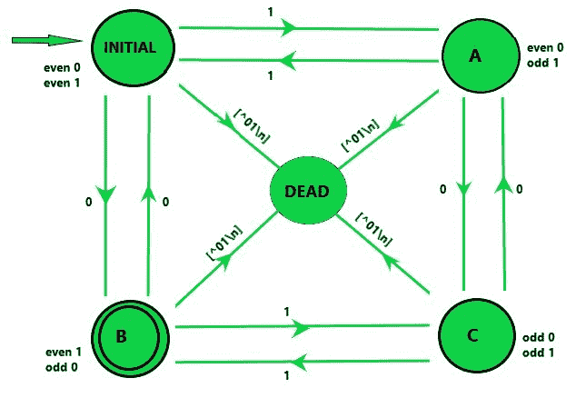
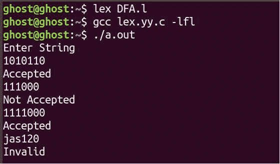

# LEX 代码中的 DFA，接受奇数个 0 和偶数个 1

> 原文:[https://www . geesforgeks . org/DFA-in-lex-code-接受奇数个 0 和偶数个 1/](https://www.geeksforgeeks.org/dfa-in-lex-code-which-accepts-odd-number-of-0s-and-even-number-of-1s/)

先决条件:[设计有限自动机](https://www.geeksforgeeks.org/dfa-machines-accepting-odd-number-of-0s-or-and-even-number-of-1s/)
**问题:**设计一个 LEX 代码来构造一个 DFA，该 DFA 接受以下语言:在输入“0”和“1”上所有奇数为 0、偶数为 1 的字符串。

**示例:**

```
Input: 10001 
Output: Accepted

Input: 10011
Output: Not Accepted

Input: asdf
Output: Invalid 
```

**方法:**
LEX 默认为我们提供一个 INITIAL 状态。所以为了制作一个 DFA，用这个作为 DFA 的初始状态。现在，我们定义了另外四种状态 A、B、C 和 DEAD，如果遇到错误或无效输入，将使用 DEAD 状态。当用户输入无效字符时，移动到“死亡”状态并打印消息“无效”，如果输入字符串在状态 B 结束，则显示消息“已接受”。如果输入字符串结束于初始状态，则显示一条消息“不接受”。(这里参考)。



**注意:**
要编译一个 lex 程序，用户需要一个 UNIX 系统和 flex，可以使用 sudo apt-get install flex 进行安装。使用上述所有规范，打开 unix 终端并执行以下操作:

1.  使用 lex 程序将规范文件更改为 C 语言程序。生成的程序在 lex.yy.c 文件中。
2.  使用带有-ll 标志的 cc 命令来编译程序，并将程序与 LEX 子程序库链接起来。生成的可执行程序在 a.out 文件中。

```
lex lextest
cc lex.yy.c -lfl 
```

**LEX Code:**

```
%{
%}

%s A B C DEAD

%%
<INITIAL>1 BEGIN A;
<INITIAL>0 BEGIN B;
<INITIAL>[^01\n] BEGIN DEAD;
<INITIAL>\n BEGIN INITIAL; {printf("Not Accepted\n");}

<A>1 BEGIN INITIAL;
<A>0 BEGIN C;
<A>[^01\n] BEGIN DEAD;
<A>\n BEGIN INITIAL; {printf("Not Accepted\n");}

<B>1 BEGIN C;
<B>0 BEGIN INITIAL;
<B>[^01\n] BEGIN DEAD;
<B>\n BEGIN INITIAL; {printf("Accepted\n");} 

<C>1 BEGIN B;
<C>0 BEGIN A;
<C>[^01\n] BEGIN DEAD;
<C>\n BEGIN INITIAL; {printf("Not Accepted\n");} 

<DEAD>[^\n] BEGIN DEAD;
<DEAD>\n BEGIN INITIAL; {printf("Invalid\n");} 

%%

int main()
 {
    printf("Enter String\n");
    yylex();
    return 0;
 }
```

**输出:**

