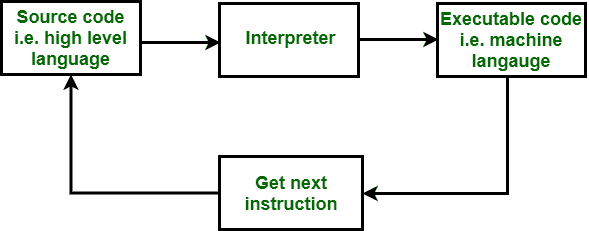

# 汇编程序和解释程序的区别

> 原文:[https://www . geesforgeks . org/汇编程序和解释程序之间的区别/](https://www.geeksforgeeks.org/difference-between-assembler-and-interpreter/)

**1。[汇编程序](https://www.geeksforgeeks.org/introduction-of-assembler/) :**
一种汇编语言，基本上是由编程语言翻译器翻译成机器语言的 GO、HALT、JUMP 和 NOT 代码等助记符，即**汇编程序**。汇编程序是以汇编语言为源代码，将其转换为**位格式**即计算机可理解的机器语言的程序。例如 NASM 和 MASM。

**2。[解释器](https://www.geeksforgeeks.org/introduction-to-interpreters/) :**
解释器是将**高级语言**转换为位格式即**机器语言**的程序。解释器和编译器的功能是相同的，但是解释器一次翻译一行并执行它。没有目标代码产生，所以每次当程序必须运行时，它首先被解释。

**汇编程序和解释程序的区别:**

| 没有。 | 装配工 | 解释者 |
| --- | --- | --- |
| 1. | 它将低级语言转换为机器语言。 | 它将高级语言转换为机器语言。 |
| 2. | 汇编程序是为特定硬件编写的。 | 解释程序是为特定语言编写的。 |
| 3. | 它是一对一的，即一条指令只能转换为一条指令。 | 它是一对多，即一条指令转换为多条指令。 |
| 4. | 它在运行前翻译整个程序。 | 它逐行翻译程序指令。 |
| 5. | 程序运行前显示错误。 | 每个解释的指令(如果有)都会显示错误。 |
| 6. | 它仅用于创建一个可执行文件。 | 每次程序运行时都会用到它。 |
| 7. | 对内存的要求比较少。 | 对内存的要求比较多。 |
| 8. | 它转换的编程语言是汇编语言。 | 它转换的编程语言有 [PHP](https://www.geeksforgeeks.org/php/) 、 [Python](https://www.geeksforgeeks.org/python-programming-language/) 、 [Perl](https://www.geeksforgeeks.org/perl-programming-language/) 、 [Ruby](https://www.geeksforgeeks.org/ruby-programming-language/) 。 |

