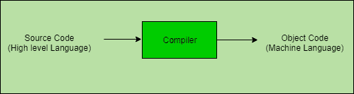

# 编译器和汇编器的区别

> 原文:[https://www . geesforgeks . org/编译器和汇编器的区别/](https://www.geeksforgeeks.org/difference-between-compiler-and-assembler/)

先决条件–[语言处理器:汇编器、编译器和解释器](https://www.geeksforgeeks.org/language-processors-assembler-compiler-and-interpreter/)

**编译器:**
编译器主要用于将源代码从高级编程语言翻译成机器级语言以创建可执行程序的程序。编译器会将整个程序视为一个完整的代码，然后进行翻译。编译器的主要工作是检查各种极限、范围、错误等。在编译器成功执行代码之前，必须从源代码中删除错误。编译语言的例子有 C、C++、Java、C#等。

**汇编程序:**
汇编程序把汇编代码作为输入，翻译成可重定位的机器码。如果出现以下情况，汇编程序将检查每条指令的正确性并生成一条诊断消息

**编译器和汇编器的区别:**

| 编译程序 | 装配工 |
| --- | --- |
| 编译器将程序员编写的源代码转换成机器语言。 | 汇编程序将汇编代码转换成机器代码。 |
| 编译器输入源代码。 | 汇编输入汇编语言代码。 |
| 它一次将整个代码转换成机器语言。 | 但是汇编程序不能马上这样做。 |
| 编译器比汇编器更聪明。 | 但是，汇编程序没有编译器聪明。 |
| 编译阶段是词法分析器、语法分析器、语义分析器、生成的中间代码、代码优化器、代码生成器和错误处理程序 | 汇编程序对给定的输入进行两个阶段，第一阶段和第二阶段。 |
| 编译器的输出是机器代码的助记版本。 | 汇编程序的输出是二进制代码。 |
| C、C++、Java 和 C#都是编译语言的例子。 | GNU 是一个汇编程序的例子。 |

