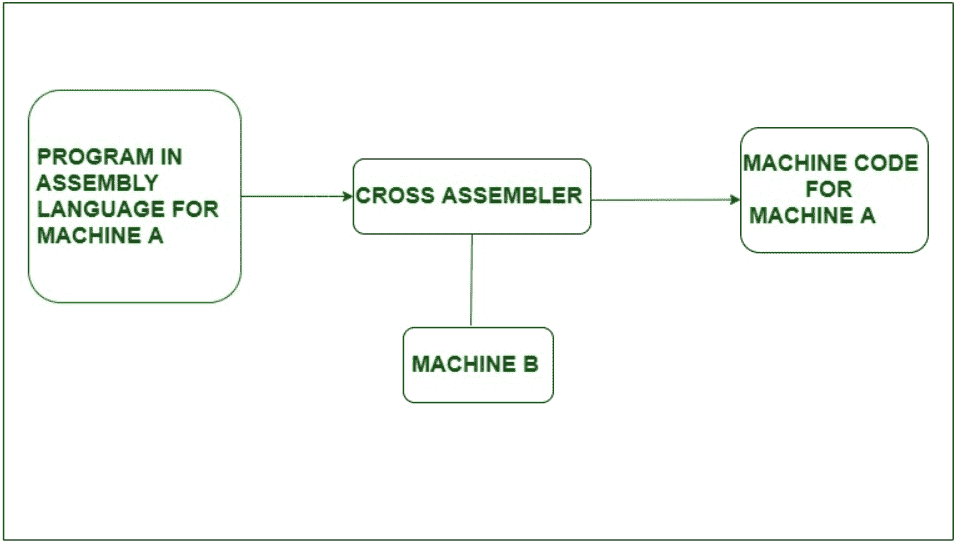
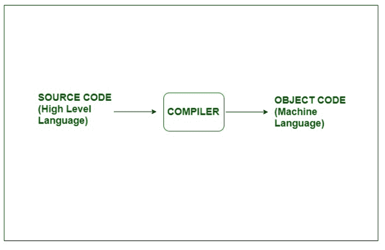

# 交叉汇编器和编译器的区别

> 原文:[https://www . geeksforgeeks . org/交叉汇编器和编译器之间的区别/](https://www.geeksforgeeks.org/difference-between-cross-assembler-and-compiler/)

**1。交叉汇编程序:**
交叉汇编程序是一种在带有一种处理器的计算机上运行，但为另一种处理器生成机器代码的汇编程序。例如，如果我们使用具有 8086 兼容机器语言的 PC 来为 8085 处理器生成机器代码，我们需要一个跨汇编程序，该程序在 PC 兼容机器上运行，但为 8085 助记符生成机器代码。它以汇编语言为输入，以机器语言为输出。

**Figure –** Cross-Assembler

在上面的框图中，我们可以看到有一个汇编程序，它运行在机器 B 上，但是将机器 A 的汇编代码转换成机器代码，这个汇编程序是交叉汇编程序。

**交叉汇编器的特点:**

*   交叉汇编程序用于将汇编语言转换成二进制机器码。
*   交叉汇编器还用于开发将在游戏控制台和其他不能独立运行开发环境小型电子系统上运行的程序。
*   交叉汇编程序可用于在低功耗系统上加速开发。
*   C 64 是交叉汇编程序的最好例子。

**2。编译器:**
编译器是将源代码从高级编程语言翻译成机器级语言的软件(程序)。它不像汇编程序的翻译那么简单。它必须执行几个步骤来生成机器代码形式的目标文件。编译器的主要工作是检查各种极限、范围、错误等。将高级语言转换为机器语言的过程称为编译。如果代码有问题，那么它会给出错误。

**Figure –** Compiler

**编译器特性:**

*   执行程序后，编译器的首要任务是创建。obj 文件然后。exe 文件。
*   编译器管理代码和变量的存储。
*   编译器负责代码的正确性并突出显示错误。
*   编译器比交叉汇编器更智能。
*   MinGW、javac 都是编译器的例子。

**交叉汇编器和编译器的区别:**

| 没有。 | 交叉汇编程序 | 编译程序 |
| --- | --- | --- |
| one | 交叉汇编程序是一种汇编程序，它在具有一种处理器的计算机上运行，但为不同类型的处理器生成机器。 | 编译器用于将源代码从高级语言转换为机器语言。 |
| --- | --- | --- |
| Two | 交叉汇编输入汇编语言代码。 | 编译器输入源代码。 |
| --- | --- | --- |
| three | 交叉汇编程序不能同时做到这一点。 | 编译器可以一次将整个代码转换成机器语言。 |
| --- | --- | --- |
| four | 交叉汇编程序不太智能。 | 它比交叉装配工更聪明。 |
| --- | --- | --- |
| five | 交叉汇编器的输出是二进制代码。 | 编译器的输出是机器代码。 |
| --- | --- | --- |
| six | 交叉汇编程序可以同时与两个处理器协作。 | 而编译器一次在一个处理器上工作。 |
| --- | --- | --- |
| seven | 交叉汇编程序的例子是 C 64。 | 编译器的例子有 GCC、javac、MinGW 等。 |
| --- | --- | --- |

