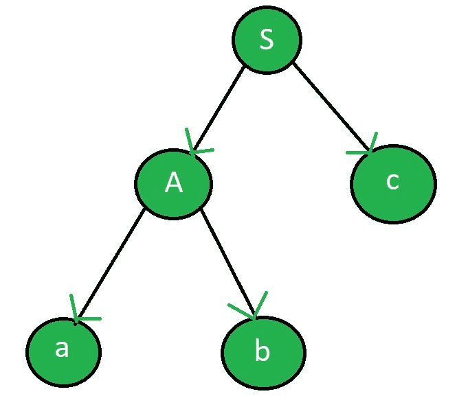

# LL 和 LR 解析器的区别

> 原文:[https://www . geesforgeks . org/ll-and-lr-parser 之间的差异/](https://www.geeksforgeeks.org/difference-between-ll-and-lr-parser/)

[LL 解析器](https://www.geeksforgeeks.org/compiler-design-construction-of-ll1-parsing-table/)包括[递归下降解析器](https://www.geeksforgeeks.org/compiler-design-recursive-descent-parser/)和非递归下降解析器。它的一种类型使用回溯，而另一种使用解析表。这些是自顶向下的解析器。
**例:**给定的语法是

```
S -> Ac
A -> ab 
```

其中 S 为起始符号，A 为非端子，A、b、c 为端子。

**输入字符串:**ABC
LL 解析器生成的解析树:



[LR Parser](https://www.geeksforgeeks.org/parsing-set-3-slr-clr-and-lalr-parsers/) 是一种自下而上的解析器，它使用解析表(动态编程)通过语法产品获得给定字符串的解析树形式。

**示例:**在上例中，LR 解析器生成的解析树:


**LL 和 LR 解析器的区别:**

<center>

| LL 解析器 | LR 解析器 |
| --- | --- |
| LL 的第一个 L 代表从左到右，第二个 L 代表最左边的求导。 | LR 的 l 表示从左到右，R 表示最右求导。 |
| 它遵循最左边的推导。 | 它遵循最右推导的相反方向。 |
| 使用 LL 解析器，解析器树是以自顶向下的方式构建的。 | 解析器树是以自下而上的方式构建的。 |
| 在 LL 解析器中，非终端被扩展。 | 在 LR 解析器中，终端被压缩。 |
| 以起始符号开始。 | 以起始符号结束。 |
| 当使用的堆栈为空时结束。 | 从空堆栈开始。 |
| 解析树的有序遍历。 | 解析器树的后序遍历。 |
| 从堆栈中弹出后读取终端。 | 终端在推入堆栈之前被读取。 |
| 它可以使用回溯或动态编程。 | 它使用动态编程。 |
| LL 更容易写。 | LR 很难写。 |
| **示例:** LL(0)，LL(1) | **例:** LR(0)，SLR(1)，LALR(1)，CLR(1) |

</center>