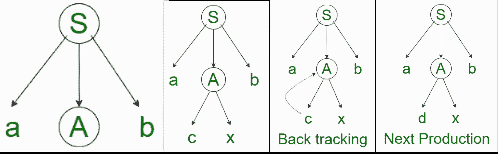
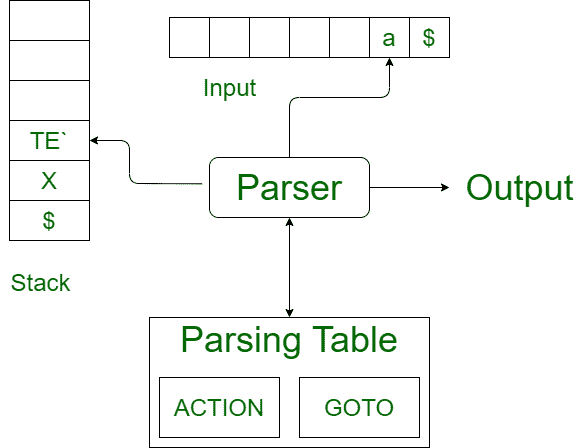

# 递归预测下降解析器和非递归预测下降解析器的区别

> 原文:[https://www . geesforgeks . org/递归-预测-下降-解析器和非递归-预测-下降-解析器的区别/](https://www.geeksforgeeks.org/difference-between-recursive-predictive-descent-parser-and-non-recursive-predictive-descent-parser/)

先决条件–[递归下降解析器](https://www.geeksforgeeks.org/recursive-descent-parser/)

**1。递归预测下降分析器:**
递归下降分析器是一种自上而下的语法分析方法，其中使用一组递归过程来处理输入。一个过程与语法的每个非终结点相关联。这里我们考虑一种简单形式的递归下降解析，称为预测递归下降解析器，其中前瞻符号明确确定每个非终端通过过程体的控制流。分析输入字符串期间的过程调用序列隐式定义了输入的解析树，如果需要，可以用来构建显式解析树。在递归下降解析中，对于单个输入实例，解析器可能有多个产品可供选择，这时回溯的概念就起作用了。

**回溯–**
这意味着，如果产品的一个派生失败，语法分析器将使用同一产品的不同规则重新启动流程。这种技术可以多次处理输入字符串，以确定正确的产量。自顶向下的解析器从根节点(开始符号)开始，将输入字符串与生产规则进行匹配以替换它们(如果匹配的话)。

要理解这一点，请以 CFG 为例:

```
S -> aAb | aBb
A -> cx | dx
B -> xe 
```

对于输入字符串 read，自上而下的解析器的行为如下。

它将从生产规则中的 S 开始，并将其产量与输入的最左侧字母，即“a”相匹配。S (S -> aAb)的产生本身就与之相匹配。因此自顶向下解析器前进到下一个输入字母(即“d”)。解析器试图展开非终端的“A”，并从左边检查它的产生(A -> cx)。它与下一个输入符号不匹配。所以自顶向下的解析器回溯得到 A 的下一个产生式规则，(A -> dx)。

现在，解析器以有序的方式匹配所有输入字母。字符串被接受。



**2。** [**【非递归预测下降解析器】**](https://www.geeksforgeeks.org/algorithm-for-non-recursive-predictive-parsing/) **:**
一种不需要任何回溯的递归下降解析形式被称为预测解析。它也被称为 [LL(1)解析表技术](https://www.geeksforgeeks.org/construction-of-ll1-parsing-table/)，因为我们将为要解析的字符串构建一个表。它能够预测哪种产品将用于替换输入字符串。为了完成它的任务，预测解析器使用一个前瞻指针，它指向下一个输入符号。为了使解析器无回溯，预测解析器对语法施加了一些约束，并且只接受一类被称为 [LL(k)语法](https://www.geeksforgeeks.org/difference-between-ll-and-lr-parser/)的语法。



预测解析使用堆栈和解析表来解析输入并生成解析树。堆栈和输入都包含一个结束符号$来表示堆栈为空，输入被消耗。解析器引用解析表来决定输入和堆栈元素的组合。可能存在没有生产匹配输入字符串的情况，使得解析过程失败。

**递归预测下降解析器和非递归预测下降解析器的区别:**

<figure class="table">

| 

递归预测下降分析器

 | 

非递归预测下降分析器

 |
| --- | --- |
| 这是一种可能需要也可能不需要回溯过程的技术。 | 这是一种不需要任何回溯的技术。 |
| 它为每个非终端实体使用过程来解析字符串。 | 它通过替换输入字符串找到要使用的产品。 |
| 这是一种自上而下的解析，由一组相互递归的过程构建而成，其中每个过程实现一个非终结语法。 | 这是一种自顶向下的方法，也是一种不使用回溯技术的递归解析。 |
| 它包含几个小函数，每个函数对应语法中的一个非终结符。 | 预测解析器使用一个指向下一个输入符号的前瞻指针，使其解析器可以自由回溯，预测解析器对语法施加了一些约束。 |
| 它接受各种语法。 | 它只接受一类被称为 LL(k)语法的语法。 |

</figure>